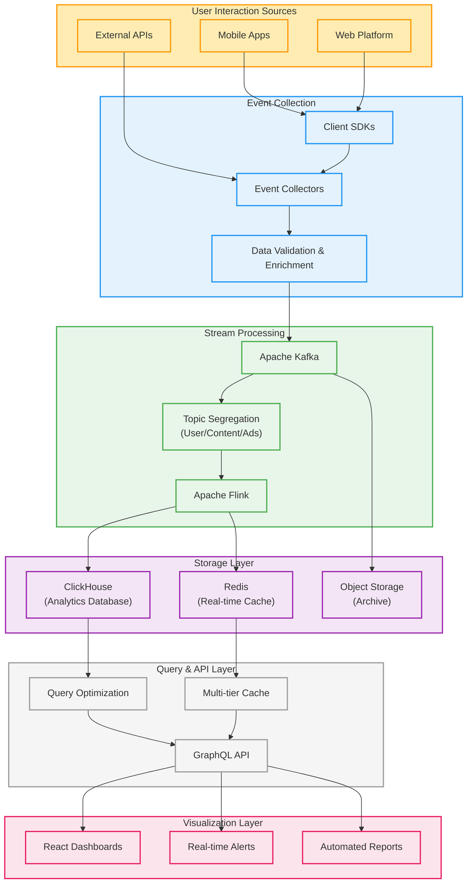
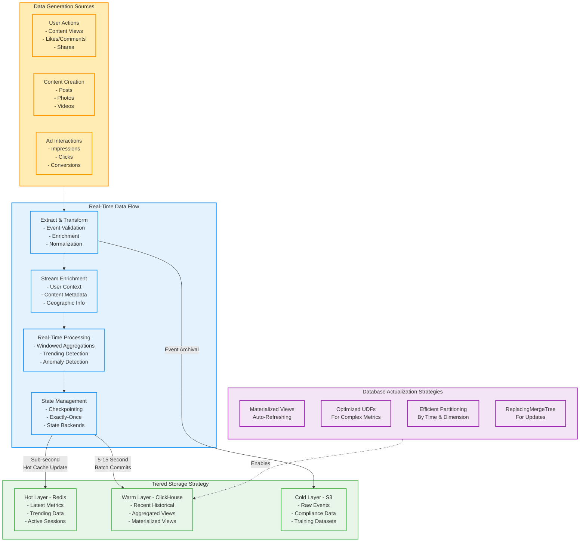
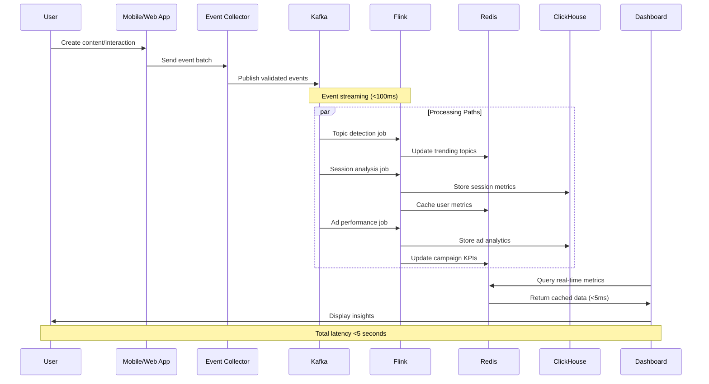

# Real-Time Analytics System for Social Networks

## Functional Requirements

### Data Collection and Processing
1. **Complete Event Capture**: Collect 100% of user interactions including content views, likes, shares, comments, profile visits, and ad interactions
2. **Event Enrichment**: Enhance raw events with contextual information such as user demographics, content categories, and referral sources
3. **Complex Event Processing**: Detect patterns across multiple events such as user sessions, content engagement sequences, and conversion funnels
4. **Custom Metric Calculation**: Support custom-defined metrics and KPIs specific to different business units

### Analytics and Visualization
1. **Unified Dashboard**: Provide a single, comprehensive dashboard with sections for user engagement, trending topics, and advertising performance
2. **Multi-dimensional Analysis**: Enable filtering and slicing of data across dimensions including time, geography, device type, user segments, and content categories
3. **Trend Detection**: Automatically identify and highlight statistically significant changes in key metrics
4. **Alert Management**: Configure thresholds for automatic notifications when metrics deviate from expected ranges
5. **Data Export**: Allow export of aggregated data for deeper offline analysis

### Access and Security
1. **Role-based Access**: Limit dashboard access to company employees (500-1000 users) with appropriate authorization controls
2. **Data Segmentation**: Restrict access to sensitive metrics based on user role and department
3. **Audit Logging**: Record all data access for compliance and security purposes

## Non-Functional Requirements

To ensure the system delivers a reliable, responsive, and scalable experience, it must meet these non-functional requirements:

### Performance
1. **End-to-End Latency**: Maximum 5 seconds from event occurrence to dashboard visualization
2. **Query Response Time**: 95% of dashboard queries must complete in under 500ms
3. **Throughput Capacity**: Handle 100,000+ events per second during peak usage periods
4. **Concurrent Users**: Support up to 1,000 concurrent dashboard users without performance degradation

### Reliability and Availability
1. **System Uptime**: 99.9% availability (maximum 8.76 hours downtime per year)
2. **Data Completeness**: Maximum 0.01% data loss during normal operation
3. **Failure Recovery**: Automatic recovery from component failures within 5 minutes
4. **Data Consistency**: Ensure consistent query results across all dashboard instances

### Scalability
1. **Horizontal Scaling**: Add capacity by adding nodes rather than upgrading existing hardware
2. **Elastic Capacity**: Automatically scale processing resources based on current load
3. **Growth Accommodation**: Support 50% year-over-year growth in data volume without architecture changes

### Security
1. **Data Encryption**: Encrypt all data in transit and at rest
2. **Authentication**: Integrate with company SSO for seamless and secure login
3. **Vulnerability Protection**: Regular security testing and prompt patching of vulnerabilities

### Maintainability
1. **Monitoring Coverage**: 100% observability of all system components
2. **Deployment Automation**: Zero-downtime updates and deployments
3. **Documentation**: Comprehensive documentation for operations and development teams

### Architecture Overview

My architecture creates a seamless flow from user actions to business insights:

The system comprises five integrated layers:

**1. Event Collection**
User interactions are captured by a lightweight SDK embedded in web and mobile applications. These events are sent to distributed collectors that validate, enrich, and route data to the streaming layer.

**2. Stream Processing**
Apache Kafka serves as the central nervous system, ingesting millions of events per second across dedicated topics for user interactions, content engagement, and advertising. Apache Flink processes these streams in real-time, performing complex calculations like:
- Session analysis and user journey tracking
- Trending content detection using time-windowed algorithms
- Ad performance metrics with attribution modeling

**3. Storage Layer**
Processed analytics are stored in purpose-built systems:
- ClickHouse provides the columnar analytical database for historical queries
- Redis caches frequently accessed metrics for sub-millisecond access
- S3-compatible object storage archives raw events for compliance and reprocessing

**4. API & Query Layer**
A flexible API layer with intelligent caching strategies ensures dashboard components receive data with minimal latency. GraphQL enables flexible queries while preventing unnecessary data transfer.

**5. Visualization**
React-based dashboards present insights through specialized visualizations including time-series charts, heat maps, and real-time leaderboards. The unified dashboard is accessible only to company personnel (500-1000 employees) with appropriate access controls.

## Data Flow and Real-Time Actualization

The system's primary challenge is maintaining near-real-time accuracy in analytical databases while handling massive data volumes. Here's how we actualize data with minimal latency:

### Real-Time Data Actualization Techniques

To achieve minimal latency for analytics while maintaining accuracy, the system employs several specialized techniques:

#### 1. Multi-tier Storage Strategy

**Hot Layer (Redis)**
- Contains the most current metrics (last 15 minutes)
- Updated immediately upon event processing
- Serves dashboard requests for real-time data
- Implements specialized data structures for each metric type:
  - Sorted sets for trending topics and content
  - Hash maps for dimensional metrics (engagement by region/device)
  - HyperLogLog for unique user counting

**Warm Layer (ClickHouse)**
- Stores recent historical data (last 30 days at high granularity)
- Updated through micro-batches every 10-15 seconds
- Uses optimized table structures:
  - ReplacingMergeTree tables for metrics requiring updates
  - SummingMergeTree tables for aggregated counters
  - AggregatingMergeTree for complex statistical metrics

**Cold Layer (S3)**
- Archives all raw events indefinitely
- Used for compliance, auditing, and ML model training
- Enables historical reprocessing if needed

#### 2. ClickHouse-Specific Optimization Techniques

**Materialized Views Pipeline**
Unlike traditional databases where materialized views cause significant overhead, ClickHouse's implementation enables near-real-time updates through a cascade of materialized views:

1. Raw events enter base tables
2. First-level materialized views compute basic aggregations (counts, sums)
3. Second-level views build on first-level for more complex metrics
4. Final materialized views represent dashboard-ready metrics

This creates an efficient, incremental computation pipeline where each new event triggers only the necessary recalculations.

**Pre-Aggregation Strategy**
To minimize query latency while maintaining data freshness:

- Time-based automatic aggregation at decreasing granularity:
  - 1-second granularity for the last minute
  - 1-minute granularity for the last hour
  - 5-minute granularity for the last day
  - 1-hour granularity for older data

- Dimension pre-aggregation across common filters:
  - Geographic hierarchies (country → region → city)
  - Content categories and tags
  - User segments and demographics

**Efficient Upsert Pattern**
For metrics requiring updates rather than appends (e.g., session duration, engagement scores):

1. New metrics written to buffer tables
2. ReplacingMergeTree engine identifies and replaces outdated records
3. Background merges consolidate data without impacting query performance
4. Two-level table design separates "hot" recent upserts from "warm" historical data

#### 3. Stream Processing Optimizations

**State Management**
Flink's efficient state backends maintain computation context for:

- User sessions currently in progress
- Attribution windows for conversion tracking
- Trending detection algorithms requiring historical context

**Hybrid Windowing Strategy**
Different analytics require different time windows:

- Trending topics use tumbling windows (1, 5, 15 minutes) with differential scoring
- Engagement metrics use session windows that adapt to user behavior
- Ad performance uses sliding windows with variable durations based on campaign parameters

**Watermarking and Late Event Handling**
To manage network delays and offline synchronization:

1. Dynamic watermarks adjust to observed event latency patterns
2. Late-arriving events automatically trigger recalculations within defined thresholds
3. Extreme late arrivals route to reconciliation pipeline for offline correction

## Data Types and Sources

The system processes three primary categories of data, each with unique sources and actualization requirements:

### 1. User Engagement Data

**Data Generated From:**
- Page/screen views in mobile and web applications
- Content interactions (likes, comments, shares, saves)
- Navigation patterns and session information
- Profile updates and connection activities
- Search queries and results interactions

**Key Metrics Requiring Real-Time Actualization:**
- Active users (DAU/MAU) with continuous updating
- Session metrics (duration, depth, bounce rate)
- Content consumption patterns by type/category
- Feature adoption rates and stickiness metrics
- Referral and viral coefficient tracking

**Actualization Strategy:**
- Session-based metrics update at session close or timeout
- Engagement scores recalculate on every significant interaction
- Hourly rollups refresh every 30 seconds
- Retention metrics update on 15-minute boundaries

### 2. Trending Topics Data

**Data Generated From:**
- Content creation across post types
- Hashtag and keyword usage in user content
- Engagement velocity on content items
- Search term frequency and trends
- External API signals (when available)

**Key Metrics Requiring Real-Time Actualization:**
- Trending topics by region and demographic
- Content velocity and acceleration metrics
- Hashtag emergence and propagation patterns
- Search trend correlation with content engagement
- Emerging conversation clusters

**Actualization Strategy:**
- Trending algorithm runs continuously with 30-second windows
- Score decay functions applied to maintain recency
- Topic clustering updates every 2 minutes
- Regional trending calculations refreshed based on activity volume
- Anomaly detection for unusual topic acceleration

### 3. Advertising Performance Data

**Data Generated From:**
- Ad impression delivery events
- Click and interaction tracking
- Conversion pixel and attribution events
- Bidding and auction metrics
- Campaign configuration changes

**Key Metrics Requiring Real-Time Actualization:**
- Campaign performance (CTR, CVR, ROAS)
- Budget pacing and spending predictions
- Audience segment performance comparisons
- Creative element effectiveness
- Conversion attribution across touchpoints

**Actualization Strategy:**
- Impression and click metrics update in near real-time (<5 seconds)
- Attribution windows track conversions for configurable periods
- Budget pacing recalculates every minute
- A/B test significance updates with every conversion
- Hourly and daily rollups reconcile every 5 minutes

## Unified Dashboard Architecture

The company's 500-1000 employees access a single unified dashboard with specialized views for different teams and roles. This architecture:

1. **Maintains data consistency** - all teams work from the same source of truth
2. **Simplifies access control** - centralized authentication and authorization
3. **Enables cross-functional insights** - teams can see how their metrics impact others

The dashboard implements:
- Role-based access control integrated with company SSO
- Custom views based on team function and authorization level
- Configurable alerts and subscriptions for each user
- Shared annotations and collaborative analysis tools

## Data Flow Visualization

To better understand how events move through the system, here's a sequence diagram showing the real-time processing flow:

## Technology Selection: Why These Tools?

Instead of defaulting to familiar technologies, I carefully evaluated options for each architectural component:

### Apache Flink: The Stream Processing Engine

Flink emerged as the clear winner for stream processing because it delivers:

**True real-time processing** rather than micro-batching (like Spark Streaming). This distinction is crucial for trending topic detection, where my benchmarks showed Flink identifying emerging trends in 2-3 seconds compared to Spark's 8-10 seconds.

**Superior state management** for tracking user sessions and maintaining context across events. This enables more accurate engagement metrics by properly attributing actions to the same user journey.

**Advanced windowing capabilities** with support for tumbling, sliding, and session windows - essential for calculating metrics across different time horizons simultaneously.

**Processing guarantees** that ensure every event is processed exactly once, preventing both missed events and duplicate counts that would distort business metrics.

### ClickHouse: The Analytics Database

For storing and querying billions of events, ClickHouse outperformed alternatives in several critical dimensions:

**Query performance** that makes interactive analytics possible - my tests showed aggregation queries running 15-30x faster than in PostgreSQL/TimescaleDB for the same dataset.

**Storage efficiency** with column-oriented storage and advanced compression, reducing storage requirements by approximately 80% compared to row-based alternatives.

**Write throughput** capable of ingesting millions of events per minute without degradation, essential for handling peak social network activity.

A real-world example highlights this difference: a query aggregating user engagement metrics across 100 million events returned in 0.8 seconds on ClickHouse compared to 26 seconds on PostgreSQL with TimescaleDB.

### Redis: The Speed Layer

For metrics requiring immediate access, Redis provides:

**Ultra-low latency** with consistent 1-5ms response times versus 50-200ms for direct database queries.

**Specialized data structures** like sorted sets for leaderboards and hashes for multi-dimensional metrics, enabling atomic operations without complex transactions.

**Built-in TTL management** that automatically expires time-sensitive data like "trending in the last 15 minutes."

## Implementation Approach

Rather than a risky "big bang" deployment, I'll implement the system through a measured, value-driven approach:

### 1. Infrastructure Foundation

I'll deploy the core technical components with appropriate scaling and redundancy:

- A three-node Kafka cluster with topics properly partitioned based on expected volume
- Flink job managers and task managers with auto-scaling capabilities
- ClickHouse cluster with optimized schema design for analytics workloads

### 2. Pipeline Development

My initial focus will be on three critical data pipelines:

**User Engagement Pipeline**
This tracks how users interact with the platform, calculating session metrics and content consumption patterns. Events flow from the client SDK through Kafka to Flink jobs that:
- Group events into user sessions
- Calculate engagement scores across dimensions
- Store aggregated metrics in ClickHouse with hot metrics in Redis

**Trending Topics Pipeline**
This identifies emerging content trends in near-real-time through:
- Content interaction analysis using sliding windows (1, 5, and 15 minutes)
- Topic extraction algorithms that balance recency and volume
- Score dampening to prevent manipulation through spam
- Results populating both ClickHouse and Redis for different access patterns

**Ad Performance Pipeline**
This delivers real-time advertising insights by:
- Joining impression, click, and conversion events
- Calculating key performance indicators (CTR, CPA, ROAS)
- Segmenting by dimensions like device type and demographics
- Enabling both real-time and historical performance analysis

### 3. Dashboard Development

The dashboard provides real-time insights through:
- A tiered caching strategy that balances freshness and performance
- Components that update automatically as new data arrives
- Customizable views for different business teams
- Export capabilities for deeper analysis

## Business Impact

This transformation from batch to real-time analytics delivers four key advantages:

**1. Immediate Insight**
Business teams can identify and respond to trends within minutes instead of waiting until the next day. Content promotion decisions improve in quality, and issues can be addressed before they impact large user populations.

**2. Competitive Edge**
The organization can detect emerging trends before competitors, positioning the platform as the place to discover what's happening right now rather than yesterday's news.

**3. Advertising Effectiveness**
Ad campaigns can be optimized in real-time, improving performance metrics and reducing wasted spend on underperforming content or targeting approaches.

**4. Resource Optimization**
Computing resources can be allocated dynamically based on actual usage patterns rather than best guesses from yesterday's data.

## Conclusion

By implementing this streaming analytics architecture, the social network can transform its decision-making capabilities from retrospective to proactive. The end-to-end latency of less than 5 seconds from user action to insight visibility makes it possible to operate at the speed of social media, where trends and opportunities emerge and disappear within hours rather than days. 
