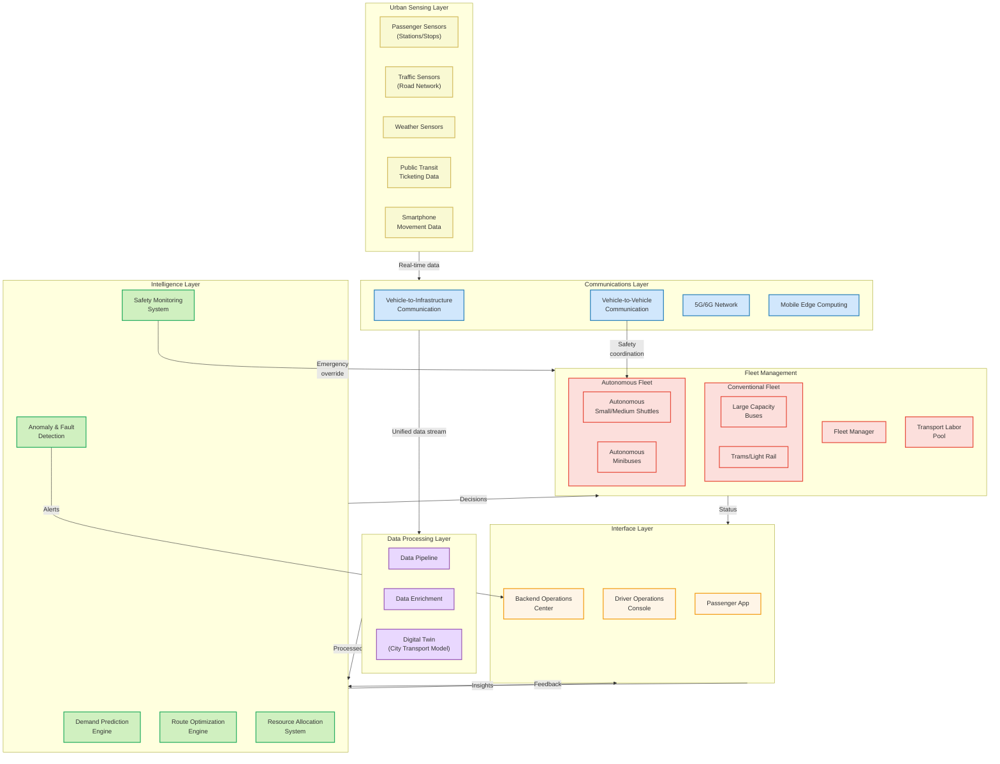

# Integrated Autonomous Transit System (IATS)

##Adaptive Autonomous Transit

I propose an Integrated Autonomous Transit System (IATS) that combines conventional high-capacity vehicles with a dynamic fleet of autonomous shuttles. This hybrid approach allows the transportation network to breathe—expanding and contracting based on real-time demand patterns.

The core innovation is not simply replacing human drivers with autonomous ones, but fundamentally rethinking how transit resources are allocated throughout the day using artificial intelligence, real-time data, and dynamic routing.

## System Architecture

## System Components and Data Flow

### 1. Urban Sensing Layer

This distributed sensor network provides continuous real-time insights into transportation conditions:

- **Passenger Sensors**: Camera-based systems at stations and stops estimate crowd sizes and waiting times
- **Traffic Sensors**: Road-embedded and roadside sensors monitor traffic flow, congestion, and incidents
- **Weather Sensors**: Provide data on conditions affecting transportation operations
- **Ticketing Data**: Fare collection systems track passenger volumes and movement patterns
- **Smartphone Movement Data**: Anonymous aggregated location data helps identify origin-destination patterns

### 2. Communications Layer

A robust, low-latency communication fabric connects vehicles, infrastructure, and control systems:

- **Vehicle-to-Infrastructure (V2I)**: Allows vehicles to communicate with traffic signals, road sensors, and central systems
- **Vehicle-to-Vehicle (V2V)**: Enables direct communication between vehicles for coordination and safety
- **5G/6G Network**: Provides high-bandwidth, low-latency connectivity for the entire system
- **Mobile Edge Computing**: Distributes computing resources across the network to reduce latency for critical functions

### 3. Data Processing Layer

Transforms raw data into actionable intelligence through:

- **Data Pipeline**: Ingests, cleanses, and normalizes multi-source data streams
- **Data Enrichment**: Enhances raw data with contextual information (historical patterns, events, etc.)
- **Digital Twin**: Maintains a near real-time virtual model of the entire transit network

### 4. Intelligence Layer

The brain of the system, using artificial intelligence to make optimal decisions:

- **Demand Prediction Engine**: Forecasts passenger demand with 15-minute, 1-hour, and 24-hour horizons
- **Route Optimization Engine**: Dynamically adjusts routes based on current demand and conditions
- **Resource Allocation System**: Determines optimal deployment of vehicles by type, size, and location
- **Safety Monitoring System**: Continuously evaluates operational safety parameters across the network
- **Anomaly & Fault Detection**: Identifies potential equipment issues before they cause service disruptions

### 5. Fleet Management

Executes intelligence-driven directives through coordinated action:

- **Conventional Fleet**: Large-capacity vehicles following fixed or semi-fixed routes
- **Autonomous Fleet**: Flexible, self-driving vehicles of varying capacities
- **Fleet Manager**: Coordinates mixed fleet operations and handles exceptions
- **Transport Labor Pool**: Human operators ready to intervene when needed

### 6. Interface Layer

Connects the system with users and operators:

- **Passenger App**: Provides real-time information, booking, and personalized travel planning
- **Driver Operations Console**: Interface for human operators of conventional vehicles
- **Backend Operations Center**: Centralized monitoring and management dashboard

## Operational Modes and Optimization Strategies

The system operates in three distinct modes, each with tailored optimization goals:

### 1. Peak Hour Mode

During high-demand periods, the system maximizes throughput while maintaining acceptable comfort levels:

- Large-capacity vehicles operate at maximum frequency on high-demand corridors
- Autonomous shuttles serve as "capacity extenders" for overcrowded routes
- Dynamic creation of express routes that skip low-utilization stops
- Predictive deployment of vehicles to locations showing rapid demand increase

### 2. Off-Peak Mode

During low-demand periods, the system prioritizes operational efficiency while maintaining service coverage:

- Reduction in large-vehicle frequency on main routes
- Deployment of smaller autonomous vehicles for "right-sized" capacity
- Shift to more demand-responsive routing with flexible stops
- Clustering of nearby low-demand requests to improve vehicle utilization

### 3. Transition Mode

During shifts between peak and off-peak periods, the system manages the reallocation of resources:

- Phased introduction/removal of vehicles to match changing demand curves
- Dynamic repositioning of autonomous vehicles to optimize for upcoming demand patterns
- Temporary hybrid routes combining fixed and demand-responsive segments

## Optimization Algorithms

The intelligence layer employs several specialized algorithms:

### 1. Multi-Horizon Demand Forecasting

Uses a hierarchical approach with different models for different time horizons:

- **Short-term (15-minute)**: Gradient-boosted trees using real-time sensor data
- **Medium-term (1-hour)**: Recurrent neural networks incorporating contextual factors
- **Long-term (24-hour)**: Transformer-based models capturing complex temporal patterns

### 2. Vehicle Assignment Optimization

A mixed-integer programming approach that:

- Minimizes total operational cost (fuel, maintenance, labor)
- Maintains defined service levels (maximum wait times, capacity utilization)
- Considers vehicle-specific constraints (range, capacity, accessibility features)
- Accounts for charging/refueling requirements of the fleet

### 3. Dynamic Route Generation

A hybrid algorithm combining:

- Graph-based routing for conventional fixed-route segments
- Clustering algorithms for demand-responsive segments
- Real-time traffic-aware pathfinding for optimal road selection

## Safety Architecture

Safety is designed as a multi-layered system with redundant protections:

### 1. Vehicle-Level Safety

Each autonomous vehicle implements:

- Redundant sensor arrays (LiDAR, radar, cameras, ultrasonic)
- Failsafe systems that bring vehicles to a safe stop if anomalies are detected
- Continuous self-diagnostic monitoring
- Geofencing to prevent operation outside approved areas

### 2. Fleet-Level Safety

Coordination across vehicles provides:

- Vehicle-to-vehicle communication to prevent conflicts
- Coordinated movement in high-density areas
- Dynamic adjustment of vehicle spacing based on conditions
- Collective intelligence about road hazards and obstacles

### 3. System-Level Safety

The central system maintains:

- Continuous monitoring of all autonomous operations
- Human oversight with override capabilities
- Anomaly detection to identify potential safety risks before incidents occur
- Automatic dispatch of human operators for complex situations

### 4. Cybersecurity

Protection against digital threats includes:

- End-to-end encryption for all command and control communications
- Segmented network architecture to contain potential breaches
- Regular security audits and penetration testing
- Air-gapped critical safety systems

## Key Trade-offs and Architectural Resolutions

### Trade-off 1: Efficiency vs. Service Quality

**Challenge**: Maximizing vehicle utilization often conflicts with providing convenient, comfortable service.

**Resolution**: The system implements a dynamic service quality threshold that varies by time, location, and demand level. During peak hours, the system allows higher occupancy while still maintaining minimum comfort standards. During off-peak hours, comfort levels increase as the efficiency pressure decreases.

### Trade-off 2: Autonomous Operation vs. Safety

**Challenge**: Higher degrees of autonomy can introduce safety risks in complex urban environments.

**Resolution**: The architecture implements a "graduated autonomy" approach where vehicles operate at different autonomy levels based on:
- Environmental complexity (weather, road conditions, traffic density)
- Time of day and visibility conditions
- Historical safety performance in specific areas
- Availability of human oversight

The system continuously calculates a "safety confidence score" that determines whether an autonomous vehicle can operate independently or requires remote monitoring.

### Trade-off 3: Fixed Routes vs. Demand-Responsive Service

**Challenge**: Traditional fixed routes provide reliability and coverage but are inefficient when demand varies.

**Resolution**: The system implements a hybrid "spine and branches" model where:
- High-capacity vehicles maintain fixed routes along major "spine" corridors
- Autonomous shuttles provide flexible "branch" services feeding into these spines
- Dynamic connection points between fixed and flexible services adjust based on demand patterns
- Service level agreements guarantee minimum service frequency even in low-demand areas

### Trade-off 4: Operational Cost vs. Availability

**Challenge**: Having enough vehicles to meet peak demand creates excess capacity during off-peak times.

**Resolution**: The architecture implements a "nested capacity" approach where:
- A core fleet operates continuously to ensure baseline service
- A secondary fleet activates during medium-demand periods
- A surge fleet deploys only during peak hours
- Autonomous vehicles dynamically switch between passenger service and other municipal functions (parcel delivery, maintenance support, etc.) during off-peak hours

### Trade-off 5: Data Collection vs. Privacy

**Challenge**: Extensive data collection enables better optimization but raises privacy concerns.

**Resolution**: The system employs a "privacy by design" approach:
- Passenger counting uses computer vision with immediate aggregation (no individual images stored)
- Trip planning data is anonymized and aggregated
- Personal data for account management is segregated from operational data
- Consumers control their data sharing preferences with clear opt-in policies

## Implementation Roadmap

The system is designed for phased implementation:

### Phase 1: Foundation (Months 1-6)
- Deploy sensing infrastructure on high-priority corridors
- Establish data processing pipeline and digital twin
- Implement demand prediction for fixed routes
- Begin training of AI models with historical data

### Phase 2: Augmentation (Months 7-12)
- Introduce first autonomous shuttles in controlled environments
- Deploy V2I infrastructure on primary routes
- Implement dynamic scheduling for conventional fleet
- Launch passenger app with real-time information

### Phase 3: Integration (Months 13-24)
- Expand autonomous fleet to connect with main transit corridors
- Implement dynamic routing for autonomous vehicles
- Deploy full safety monitoring system
- Begin off-peak service optimization

### Phase 4: Transformation (Months 25-36)
- Scale autonomous fleet to provide comprehensive coverage
- Implement full demand-responsive service in residential areas
- Optimize conventional fleet size and allocation
- Deploy advanced predictive maintenance system

## Expected Outcomes and Benefits

### 1. Passenger Experience Improvements
- Reduced wait times (estimated 40% decrease during peak hours)
- Increased service frequency (100% improvement in off-peak hours)
- More direct routes (25% reduction in average travel time)
- Enhanced reliability (90% on-time performance target)

### 2. Operational Efficiencies
- Reduced operating costs (estimated 30% savings)
- Lower emissions (40% reduction through right-sizing and electrification)
- Improved fleet utilization (85% target vs. current 60%)
- Extended service hours without proportional cost increase

### 3. System Performance
- Enhanced adaptability to demand fluctuations
- Improved resilience during disruptions
- Data-driven continuous improvement
- Scalable platform for future mobility innovations

## Conclusion

The Integrated Autonomous Transit System transforms public transportation from a rigid, schedule-based system to a dynamic, demand-responsive service. By intelligently combining conventional and autonomous vehicles, it addresses the fundamental inefficiencies of urban transit while maintaining the reliability and coverage that citizens expect.

The architecture's focus on safety, graduated implementation, and thoughtful resolution of key trade-offs provides a realistic pathway for cities to evolve their transit systems without disrupting existing services. The result is a more sustainable, efficient, and passenger-friendly urban mobility system.

Beyond the immediate benefits, this architecture establishes a foundation for future mobility innovations, creating a flexible platform that can incorporate new vehicle types, service models, and technologies as they emerge. 