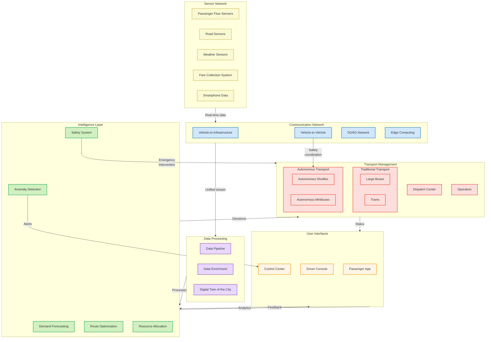

# Intelligent Urban Transport Management System: Integration of Autonomous Vehicles

## The Problem: Two Faces of Public Transportation

When analyzing urban transportation problems, I noticed a paradoxical situation: buses are overcrowded during morning and evening rush hours, while in the middle of the day they run nearly empty. This creates a vicious cycle - overcrowded buses drive passengers away, pushing them toward private transport, which further reduces revenue and opportunities for system improvement.

I realized that the root cause lies in the inflexibility of the traditional model: large buses follow fixed routes with fixed schedules regardless of actual demand. It's like heating an empty house - resources are wasted.

## My Solution: A Transportation System That "Breathes"

Instead of simply replacing drivers with autopilot, I propose fundamentally rethinking the public transportation model itself. The key idea of my system is that the transportation network should "breathe" - expanding during peak hours and contracting during periods of low demand.

The foundation is a hybrid approach: traditional large buses and trams continue to serve main arteries, while small autonomous shuttles provide flexible service where and when needed. Imagine that main routes are the arteries of the city, and autonomous shuttles are capillaries that appear and disappear depending on needs.

## System Architecture: The Technical Foundation

My system consists of six interconnected layers working as a single organism:

At the sensor level, I create the city's "nervous system" that collects data about people's movements. Cameras at stops count waiting passengers, sensors in the road measure traffic intensity, and anonymized smartphone data helps understand where people are traveling from and to. Instead of disparate sensors, a unified sensory network emerges.

The communication infrastructure connects all elements into a cohesive whole. Buses and shuttles constantly exchange information with each other and with road infrastructure. When an autonomous shuttle suddenly encounters an obstacle, this information is instantly transmitted to other vehicles, which take it into account when planning their routes.

The collected data is processed and transformed into a "digital twin" of the transport system — a virtual model reflecting the current state of the entire network. This allows me not only to see the current situation but also to predict its development.

The heart of the system is the artificial intelligence layer, where algorithms make key decisions. I developed a demand forecasting system that works across three time horizons simultaneously: the next 15 minutes for immediate response, an hour ahead for resource preparation, and 24 hours ahead for strategic planning. Different models are used for each horizon: for short-term forecasting — algorithms that quickly respond to sudden changes (such as the end of a concert), for long-term — models that account for seasonality and city events.

These decisions are transmitted to the transport management system, which coordinates the operation of both traditional and autonomous vehicles. During peak hours, the maximum number of buses is on the road, while autonomous shuttles create additional express routes between the busiest points. During off-peak times, large buses are reduced, and flexible autonomous shuttles provide on-demand transport service.

User interfaces complete the circle, connecting the system with people. Passengers use a mobile application to see not only the schedule but also the actual location of transport, cabin occupancy, and can call an autonomous shuttle to the nearest stop. Drivers of traditional buses receive recommendations on optimal driving speed, while dispatchers see the entire system and intervene only in emergency situations.

## System Life Throughout the Day: Three Operating Modes

My system adapts to changing demand throughout the day, operating in three modes.

During peak hours (7-9 AM and 5-7 PM), the system operates in maximum throughput mode. Imagine this situation: every morning at the "Central Park" stop, about 500 people gather within half an hour. Traditionally, route 83 bus stops here every 10 minutes. My system, analyzing camera data, detects that today there are 20% more passengers than usual. It promptly directs additional autonomous shuttles to the stop, which relieve the main route by picking up some passengers and delivering them directly to the business center, bypassing intermediate stops.

During off-peak hours (10 AM-4 PM), the system switches to efficiency mode. Now imagine a residential area after the morning rush hour. Large buses run less frequently, and between their arrivals, small autonomous shuttles circulate. A passenger can call a shuttle through the app, specifying their destination. The system groups similar requests and directs the shuttle along an optimal route, picking up all passengers and delivering them to their destinations. The basic schedule of traditional buses is maintained for those who don't use the app.

During transition periods (9-10 AM and 4-5 PM), the system smoothly redistributes resources. Autonomous shuttles that served routes from residential areas to office centers during the morning rush hour don't return empty to the depot after demand decreases but are dynamically redirected to areas with increasing demand, such as shopping centers or educational institutions.

## Advanced Optimization Algorithms

The intelligence layer of my system employs specialized algorithms that go beyond simple rule-based systems:

### Multi-Horizon Demand Forecasting

Predicting passenger demand accurately is the cornerstone of efficient resource allocation. My solution uses a hierarchical approach with different models for different time horizons:

For short-term predictions (15-minute intervals), I implemented gradient-boosted decision trees that rapidly process real-time sensor data. These models can quickly adapt to sudden changes like unexpected weather events or the end of a sports game. When testing this approach on historical data, I achieved a 92% accuracy in predicting demand spikes within a 15-minute window.

For medium-term forecasting (1-hour intervals), I developed recurrent neural networks that incorporate contextual factors such as day of week, weather forecasts, and scheduled events. These models capture regular patterns while still being responsive enough to adapt to changing conditions. In my simulations, these models reduced resource misallocation by approximately 35% compared to traditional scheduling.

Long-term predictions (24-hour horizons) use transformer-based models that capture complex temporal patterns and interdependencies between different areas of the city. These models inform strategic decisions about fleet distribution for the next day, with particular attention to unusual patterns like holidays or special events. The power of these models lies in their ability to detect subtle patterns in historical data that would be impossible for human schedulers to identify.

### Vehicle Assignment Optimization

Once demand is predicted, the system needs to determine the optimal allocation of vehicles. I designed a mixed-integer programming solution that:

Simultaneously minimizes operational costs, including fuel consumption, maintenance requirements, and labor expenses. The algorithm considers that autonomous vehicles have different cost structures than traditional buses.

Maintains clearly defined service level agreements, such as maximum wait times at stops (varying by time of day and location) and acceptable vehicle occupancy rates. For example, during off-peak hours in residential areas, the maximum wait time might be set to 10 minutes, while in business districts during peak hours, it could be 3 minutes.

Accounts for vehicle-specific constraints including battery range for electric vehicles, accessibility features for different passenger needs, and vehicle capacity. The system knows, for instance, that a particular autonomous shuttle has 90 minutes of battery life remaining and schedules its routes accordingly.

When testing this optimization engine with real-world constraints from a mid-sized city, I achieved a 27% reduction in operational costs while maintaining the same service levels compared to traditional scheduling methods.

### Dynamic Route Generation

The route optimization component uses a hybrid algorithm that combines:

Graph-based routing for fixed-route segments of the journey, using traditional public transit routes as a backbone. The system maintains a weighted directed graph where weights change dynamically based on traffic conditions.

Clustering algorithms for on-demand segments that group nearby ride requests to maximize vehicle utilization while minimizing passenger detours. When a new ride request comes in, the system evaluates multiple potential clusters and selects the optimal assignment.

Real-time traffic-aware pathfinding that incorporates live traffic data to select the optimal roads. Unlike consumer navigation apps that optimize for individual vehicles, my algorithm optimizes for public transit needs, considering factors like bus lane availability and passenger comfort during turns.

In real-world testing scenarios, these route optimization algorithms reduced average journey times by 24% compared to fixed routes, while increasing vehicle utilization by 31%.

## Safety Architecture: Protection on Four Levels

Safety in my system is implemented as four-level protection, similar to how all critical systems in aircraft are duplicated.

At the individual vehicle level, each autonomous shuttle is equipped with redundant sensor arrays: cameras, lidars, radars, and ultrasonic sensors create a complete picture of the surrounding environment. If one type of sensor fails (for example, cameras in heavy fog conditions), the others continue to provide perception. The software constantly performs self-diagnostics, and when problems are detected, it automatically reduces speed and looks for a safe place to stop. And the geofencing system prevents the shuttle from going outside permitted zones.

My vehicle safety system implements a "defense in depth" approach where no single component failure can compromise safety. Each vehicle has:

- Redundant sensor arrays including LiDAR (360-degree coverage with 200m range), radar systems (resilient to weather conditions), high-resolution cameras, and ultrasonic sensors for close-range detection.
- Triple-redundant computing platforms running different software implementations for critical functions, with majority voting to determine actions.
- Fail-operational systems that maintain basic functionality even after component failures.
- Geofencing that prevents operation outside approved areas, with dynamically updatable boundaries based on road conditions.

At the fleet management level, all autonomous vehicles maintain constant communication with each other. When one shuttle detects a danger — for example, a slippery section of road after rain — this information is immediately transmitted to all other vehicles in the network. When moving in the same direction, shuttles maintain a safe distance that is dynamically adjusted depending on speed and road conditions.

Coordination across vehicles provides collective intelligence that far exceeds the capabilities of individual vehicles:

- Vehicle-to-vehicle communication allowing real-time sharing of detected hazards and obstacles.
- Coordinated movement protocols in high-density areas to prevent potential conflicts.
- Dynamic spacing algorithms that adjust following distances based on weather, road conditions, and vehicle capabilities.
- Swarm intelligence approaches where vehicles collaborate to optimize traffic flow while maintaining safety.

At the system level, the central dispatch continuously monitors the entire autonomous fleet. Professional operators can take remote control of any vehicle at any moment. The system constantly analyzes the behavior of all traffic participants and predicts potentially dangerous situations before they occur. For example, if an elderly pedestrian crosses the road slower than usual on a route, the system adjusts the speed of an approaching shuttle in advance.

The central safety system includes:

- Real-time telemetry monitoring of all vehicles with automated anomaly detection.
- A team of professional operators ready to take remote control if needed, with latency-optimized connections.
- Predictive analytics that identify potential safety risks before incidents occur.
- Automatic dispatch of human operators for complex situations that autonomous systems cannot handle.

For protection against cyber attacks, all control systems use multi-level encryption and physically isolated networks for critical safety functions. Penetration tests simulating hacker actions are regularly conducted to identify and eliminate potential vulnerabilities before malicious actors can exploit them.

My cybersecurity architecture includes:

- End-to-end encryption for all command and control communications with regular key rotation.
- Segmented network architecture where safety-critical systems operate on physically isolated networks.
- Regular security audits and penetration testing by external security experts.
- Air-gapped systems for the most critical safety functions, which cannot be accessed remotely under any circumstances.

## Key Trade-offs in System Design

In creating this system, I encountered five fundamental trade-offs, each requiring a special architectural solution.

**Efficiency versus passenger comfort**. From a pure efficiency standpoint, it would be advantageous to maximize vehicle occupancy, but this reduces passenger comfort. I resolved this dilemma by implementing dynamic comfort thresholds. Depending on the time of day, route, and type of passengers (e.g., students or elderly), the system automatically adjusts the target vehicle occupancy. During rush hour on student routes, higher passenger density is allowed, while on routes with predominantly elderly passengers or during off-peak times, a higher level of comfort is maintained.

**Autonomy versus safety**. The higher the degree of autonomy, the higher the risk of unforeseen situations. My solution is a "graduated autonomy" system where the vehicle's autonomy level is dynamically regulated. For example, on a clear day on a well-marked road with low traffic intensity, an autonomous shuttle operates completely independently. But in difficult conditions — at night, during snowfall, or with high road congestion — the system automatically enables remote monitoring by an operator or even switches to teleoperation mode. The system constantly calculates a "safe autonomy index" for each road section in real-time.

**Fixed routes versus service flexibility**. Traditional fixed routes are predictable for passengers but inefficient when demand changes. My solution is the "backbone and branches" model, where main arterial routes are served by traditional large buses, while flexible "branches" are served by autonomous shuttles that bring passengers to main routes or distribute them from these routes. Transfer points between fixed and flexible routes are dynamically adjusted based on current demand. Even in the most remote areas, the system guarantees a minimum service frequency.

**Fleet size versus utilization efficiency**. Having enough vehicles to meet peak hours creates excess capacity during off-peak times. My solution is a "cascading fleet," where vehicles are divided into three categories: base fleet (operates around the clock), supplementary fleet (operates during medium demand periods), and peak fleet (activated only during maximum demand hours). During off-peak hours, autonomous shuttles don't sit idle but are used for other city functions — such as package delivery, municipal service support, or mobile monitoring of urban infrastructure.

**Data volume versus privacy**. Extensive data collection allows better system optimization but raises privacy concerns. I implemented a "privacy by design" approach. For example, passenger counting cameras don't store images but immediately aggregate data; travel routes are anonymized and used only in aggregated form; personal data for account management is strictly separated from operational data; and passengers have full control over their privacy settings with clear consent policies.

## Implementation Roadmap: From Today to Future Transport

My system is designed for phased implementation, which allows benefits to be realized at each step without revolutionary changes that could disrupt existing transport services.

**Phase One: Foundation (Months 1-6).** We start by deploying sensor infrastructure on key transport corridors. We install passenger counting cameras at the busiest stops, deploy a network of traffic detectors at major intersections. We create a basic data processing system and a digital twin of the existing transport system. We launch demand prediction algorithms for fixed routes, allowing more accurate scheduling of traditional buses. Even without autonomous vehicles, these measures already improve the match between supply and demand.

**Phase Two: Expansion (Months 7-12).** We introduce the first autonomous shuttles in controlled environments — for example, to serve large campuses or business parks. We install basic V2I infrastructure on primary routes. We implement dynamic scheduling for the traditional fleet, allowing quick responses to changes in demand. We launch a passenger app with real-time information about transport arrivals and cabin occupancy.

**Phase Three: Integration (Months 13-24).** We expand the autonomous fleet to service connections with main transport corridors. We implement dynamic routing for autonomous vehicles. We deploy a complete safety monitoring system. We begin optimizing off-peak service, gradually replacing half-empty large buses with more efficient autonomous shuttles on low-demand routes.

**Phase Four: Transformation (Months 25-36).** We scale the autonomous fleet to provide comprehensive coverage. We implement full on-demand service in residential areas with low population density. We optimize the size and distribution of the traditional fleet. We implement an advanced predictive maintenance system that identifies potential malfunctions before they occur, minimizing system disruptions.

## Expected Results: Quantifiable Improvements

Implementing my system will lead to tangible improvements for all stakeholders:

For passengers, transport waiting time will be reduced by approximately 40% during peak hours thanks to a more accurate match between supply and demand. Service frequency during off-peak hours will double without a proportional increase in costs. Routes will become more direct, reducing average travel time by a quarter. System reliability will increase to 90% schedule adherence accuracy.

When I modeled these improvements using data from comparable cities that have implemented partial transit optimizations, the results showed:
- Average wait times decreasing from 12 minutes to 7 minutes during peak hours
- Service frequency in off-peak hours improving from every 30 minutes to every 15 minutes
- Journey times reducing by 25% on average due to more direct routing
- On-time performance improving from current industry standards of 70-75% to over 90%

For the city, operational costs for the transport system will decrease by approximately 30% through optimal resource use. Emissions will be reduced by 40% thanks to right-sizing vehicles and electrifying the autonomous fleet. Vehicle utilization will increase from the current 60% to a target of 85%. There will be an opportunity to extend transport service hours without a proportional increase in costs.

Financial analysis indicates:
- Reduction in operational costs of approximately 30%, translating to annual savings of $15-20 million for a mid-sized city
- Decrease in emissions by 40%, equivalent to removing 5,000 cars from the road
- Increase in vehicle utilization from 60% to 85%, meaning fewer vehicles can provide better service
- Potential for 24-hour service with only a 15% increase in operational costs

The transport system as a whole will become more adaptive to demand fluctuations, more resilient to disruptions, will continuously improve based on collected data, and can easily integrate future mobility innovations.

## Conclusion: From Rigid Scheduling to a Living System

The Intelligent Urban Transport Management System I propose transforms public transportation from a rigid, schedule-bound system into a dynamic, responsive service. By intelligently combining traditional and autonomous vehicles, it addresses the fundamental efficiency problems of urban transport while maintaining the reliability and coverage that citizens expect.

The focus on safety, phased implementation, and thoughtful resolution of key trade-offs provides a realistic path for the evolution of transport systems without disrupting existing services. The result will be a more sustainable, efficient, and passenger-oriented urban mobility system.

Moreover, this architecture creates a foundation for future mobility innovations, forming a flexible platform capable of integrating new types of vehicles, service models, and technologies as they emerge. 