# MOSAIC: Cultural Tapestry Approach to Global Internship Matchmaking

## Reframing the Global Internship Challenge

The current internship landscape resembles isolated islands of opportunity, disconnected by barriers of geography, language, culture, and bureaucracy. Students struggle to discover international opportunities that match their unique skills, while companies cannot effectively tap into global talent pools due to complex hiring procedures, visa requirements, and documentation challenges.

Traditional solutions approach this problem through a transactional lens - creating simple job boards or matching algorithms that fail to address the multidimensional complexity of cross-cultural professional exchange. Instead, I propose MOSAIC: a global internship marketplace built on the metaphor of cultural tapestry-weaving, where each internship becomes a transformative integration of diverse perspectives rather than a mere employment transaction.

## The MOSAIC Framework: Cultural Integration Through Professional Exchange

MOSAIC (Multidimensional Opportunity and Skill-Aligned International Careers) reimagines the global internship marketplace through the metaphor of cultural tapestry-weaving, where:

1. Each student represents a unique thread with distinctive patterns (skills, perspectives, cultural backgrounds)
2. Companies offer canvases (internship opportunities) that gain strength and beauty through the integration of diverse threads
3. The platform acts as a master weaver, aligning threads with canvases while ensuring the structural integrity of each connection

This approach elevates international internships beyond mere work experiences to become cultural integration vehicles that create lasting value for students, companies, and global society.

## Core Innovation: The Cultural Integration Matrix

At the heart of MOSAIC lies the Cultural Integration Matrix (CIM) - a multidimensional framework that transcends traditional skills-based matching:

The CIM evaluates matches across three dimensions:

1. **Professional Synergy (X-Axis)**: Alignment of technical skills, soft skills, career trajectories, and work style preferences

2. **Cultural Compatibility (Y-Axis)**: Assessment of values alignment, cultural adaptability, language proficiency, and global mindset

3. **Legal & Regulatory (Z-Axis)**: Analysis of visa eligibility, work permit requirements, education verification, and other compliance factors

This multidimensional approach enables MOSAIC to create matches that not only fulfill immediate professional needs but also facilitate meaningful cultural exchange and ensure regulatory compliance.

## Functional Requirements

### 1. Profile Creation and Cultural Mapping

#### For Students:
1. **Multidimensional Profile Builder**: Create comprehensive profiles including academic background, technical skills, cultural experiences, language proficiencies, and career aspirations
2. **Cultural Self-Assessment**: Complete cultural adaptability and global mindset assessments
3. **Document Repository**: Upload and manage educational certificates, language proficiency proofs, passport, and previous visa documentation
4. **Journey Mapping**: Define preferred geographic regions, cultural experiences sought, and professional development goals
5. **Digital Portfolio**: Showcase projects, writing samples, and other evidence of skills and achievements

#### For Companies:
1. **Opportunity Canvas Creation**: Define comprehensive internship opportunities including required skills, cultural aspects of the workplace, mentorship approach, and growth opportunities
2. **Cultural Environment Profile**: Document company culture, team composition, and integration approaches for international interns
3. **Compliance Framework**: Define visa sponsorship capabilities, work permit processes, and regulatory requirements
4. **Mentorship Mapping**: Identify mentors with cross-cultural experience to support international interns
5. **Outcome Tracking**: Define clear deliverables, evaluation criteria, and potential pathways to future employment

### 2. Intelligent Matching and Recommendation

1. **Multidimensional Matching Algorithm**: Utilize the Cultural Integration Matrix to identify optimal student-opportunity matches
2. **Contextual Recommendations**: Provide personalized opportunity recommendations based on student profiles and preferences
3. **Gap Analysis**: Identify skills or experience gaps with suggested resources to address them
4. **Compatibility Visualization**: Present match quality across professional, cultural, and regulatory dimensions
5. **Alternative Pathways**: Suggest parallel opportunities that might not be obvious but offer strong overall fit

### 3. Documentation and Compliance Management

1. **Digital Document Verification**: Verify educational credentials, language certificates, and identity documents
2. **Visa Requirement Analysis**: Determine visa requirements based on student nationality and internship location
3. **Automated Application Assembly**: Generate tailored application packages meeting specific country and company requirements
4. **Compliance Tracking**: Monitor regulatory changes affecting international internships
5. **Audit Trail**: Maintain secure records of all verification processes and submissions
6. **Document Translation**: Provide certified translation services for essential documentation

### 4. Application and Selection Process

1. **Customizable Application Workflows**: Configure multi-stage application processes tailored to company needs
2. **Cultural Context Briefings**: Provide cultural insights to both parties before interviews
3. **Integrated Video Interviews**: Conduct and record interviews with real-time translation capabilities
4. **Collaborative Evaluation**: Enable structured team-based assessment of candidates
5. **Culturally-Aware Feedback**: Provide feedback in culturally appropriate formats for unsuccessful candidates

### 5. Pre-Departure and Integration Support

1. **Cultural Preparation Program**: Deliver customized cultural training for selected interns
2. **Logistics Coordination**: Assist with travel arrangements, accommodation, and local setup
3. **Regulatory Compliance Checklist**: Ensure all legal requirements are met before departure
4. **Digital Orientation**: Provide virtual orientation to company, team, and location
5. **Community Connection**: Link interns with relevant cultural communities at destination
6. **Language Support**: Offer targeted language training for professional contexts

### 6. Experience Management and Growth Tracking

1. **Structured Check-ins**: Schedule regular check-ins with interns and supervisors
2. **Development Tracking**: Monitor skills acquisition and professional growth
3. **Cultural Integration Assessment**: Evaluate cultural adaptation and integration
4. **Issue Resolution**: Provide mediation and support for any challenges
5. **Experience Documentation**: Help interns document their learnings and achievements
6. **Network Building**: Facilitate connections with relevant professional networks

### 7. Post-Internship Transition and Alumni Engagement

1. **Experience Reflection**: Guide structured reflection on professional and cultural learnings
2. **Skills Certification**: Provide verified documentation of skills gained
3. **Career Pathway Planning**: Support next steps in international career development
4. **Alumni Network Integration**: Connect interns to global alumni community
5. **Knowledge Transfer**: Capture insights to improve future matching and support

## Non-Functional Requirements

### 1. Performance and Scalability

1. **Response Time**: User interactions including search, matching, and recommendations must respond within 2 seconds
2. **Concurrency Support**: Platform must support 100,000+ concurrent users during peak application seasons
3. **Document Processing**: Document verification must complete within 24 hours for 95% of submissions
4. **Global Availability**: System must maintain 99.9% availability across all global regions
5. **Elastic Scaling**: Infrastructure must automatically scale to handle seasonal application surges

### 2. Security and Privacy

1. **Document Security**: All identity and educational documents must be encrypted at rest and in transit
2. **Regional Compliance**: Data handling must comply with GDPR, CCPA, and other regional privacy regulations
3. **Granular Permissions**: Role-based access control for all sensitive data
4. **Security Certifications**: Maintain ISO 27001 certification and annual SOC 2 Type II audits
5. **Breach Prevention**: Implement advanced threat protection and regular penetration testing
6. **Data Residency**: Store personally identifiable information in appropriate geographic regions

### 3. Reliability and Availability

1. **Geographical Redundancy**: Deploy infrastructure across multiple regions to ensure global accessibility
2. **Disaster Recovery**: Maintain recovery point objective (RPO) of 15 minutes and recovery time objective (RTO) of 1 hour
3. **Fault Tolerance**: System must continue functioning despite the failure of any single component
4. **Data Backup**: Implement automated backups with 30-day retention policy
5. **Service Level Agreement**: Guarantee 99.9% uptime with planned maintenance windows during low-usage periods

### 4. Usability and Accessibility

1. **Multilingual Support**: Interface available in at least 15 major world languages
2. **Cultural Adaptability**: Adapt interface layout, color schemes, and interaction patterns to regional preferences
3. **Accessibility Compliance**: Meet WCAG 2.1 AA standards for accessibility
4. **Responsive Design**: Fully functional across desktop, tablet, and mobile devices
5. **Low Bandwidth Support**: Core functions must work in regions with limited internet connectivity
6. **Offline Capabilities**: Enable document preparation and form completion in offline mode

### 5. Interoperability and Integration

1. **Education System Integration**: API connections to major university credential verification systems
2. **Visa System Compatibility**: Integration with visa processing systems where APIs are available
3. **Identity Verification**: Integration with global identity verification services
4. **Calendar Synchronization**: Support for major calendar systems for interview scheduling
5. **Learning Management Systems**: Integration with popular LMS platforms for pre-departure training
6. **HR Systems**: Compatibility with common HRIS platforms used by host companies

### 6. Auditability and Compliance

1. **Comprehensive Logging**: Maintain detailed logs of all system activities, especially relating to document processing
2. **Compliance Monitoring**: Automatically track and alert on regulatory requirement changes
3. **Verification Trail**: Maintain immutable records of all verification steps and outcomes
4. **Regulatory Reporting**: Generate reports required by international labor and education authorities
5. **Data Retention**: Implement appropriate data retention policies compliant with global regulations

### 7. Cultural Sensitivity and Ethical Standards

1. **Bias Prevention**: Regularly audit matching algorithms for cultural, gender, or other biases
2. **Ethical AI**: Ensure all AI-driven recommendations adhere to transparent ethical guidelines
3. **Cultural Sensitivity**: Review all content and interactions for cultural appropriateness
4. **Fair Opportunity**: Ensure equitable access regardless of nationality or economic background
5. **Sustainability**: Minimize environmental impact of operations, particularly related to travel

## Technical Architecture: The Cultural Bridge System

MOSAIC is built on a microservices architecture optimized for global scale, cultural context awareness, and regulatory compliance. The system comprises five key layers:

### Detailed System Architecture

To illustrate the technical implementation more concretely, here's a detailed deployment architecture showing how the system components are realized across cloud infrastructure:

This deployment architecture illustrates how MOSAIC achieves global scalability, regional data compliance, and high availability:

1. **Multi-regional Deployment**: Services are deployed across three major geographic regions (Americas, Europe, Asia-Pacific) to ensure low latency and data residency compliance
2. **Edge Security**: Multi-layered security starting at the edge with CDN, WAF, and DDoS protection
3. **Regional Data Sovereignty**: Each region maintains its own primary database clusters to comply with data residency requirements
4. **Service Mesh Architecture**: Each regional deployment uses a service mesh for service discovery, circuit breaking, and resilience
5. **Global Services**: ML infrastructure, storage, and operations tools are globally available while respecting data boundaries

### Database Architecture

The data tier employs a polyglot persistence strategy with specialized databases for different data types and access patterns:

```mermaid
erDiagram
    STUDENT ||--o{ DOCUMENT : uploads
    STUDENT ||--o{ APPLICATION : submits
    STUDENT {
        uuid id
        string full_name
        string email
        date dob
        string nationality
        jsonb academic_background
        jsonb technical_skills
        jsonb language_proficiencies
        jsonb cultural_experiences
        jsonb career_aspirations
        point current_location
        jsonb preferences
        jsonb assessment_results
    }
    
    DOCUMENT {
        uuid id
        uuid owner_id
        string doc_type
        string filename
        string content_type
        string status
        timestamp upload_date
        jsonb verification_results
        string storage_path
    }
    
    COMPANY ||--o{ OPPORTUNITY : posts
    COMPANY {
        uuid id
        string name
        string industry
        point hq_location
        jsonb locations
        jsonb culture_profile
        jsonb compliance_capabilities
        jsonb subscription_details
    }
    
    OPPORTUNITY ||--o{ APPLICATION : receives
    OPPORTUNITY {
        uuid id
        uuid company_id
        string title
        text description
        string location
        date start_date
        date end_date
        int duration_weeks
        jsonb required_skills
        jsonb cultural_environment
        jsonb compensation
        jsonb mentorship_approach
        jsonb visa_sponsorship
    }
    
    APPLICATION {
        uuid id
        uuid student_id
        uuid opportunity_id
        string status
        timestamp submission_date
        jsonb documents
        jsonb evaluation_results
        jsonb compliance_checklist
        text student_notes
        text company_notes
    }
    
    MATCH {
        uuid id
        uuid student_id
        uuid opportunity_id
        float professional_synergy_score
        float cultural_compatibility_score
        float regulatory_feasibility_score
        float overall_match_score
        jsonb detailed_analysis
        timestamp created_at
    }
    
    COMPLIANCE_REQUIREMENT {
        uuid id
        string country
        string requirement_type
        text description
        jsonb document_requirements
        jsonb verification_steps
        date effective_from
        date effective_to
    }
    
    INTERNSHIP ||--|| APPLICATION : results_from
    INTERNSHIP {
        uuid id
        uuid student_id
        uuid company_id
        uuid opportunity_id
        date start_date
        date end_date
        string status
        jsonb check_in_history
        jsonb skill_development
        jsonb cultural_integration
        jsonb completion_certificate
    }
    
    STUDENT ||--o{ MATCH : receives
    OPPORTUNITY ||--o{ MATCH : generates
    OPPORTUNITY }|--|| COMPLIANCE_REQUIREMENT : must_satisfy
    STUDENT ||--o{ INTERNSHIP : participates_in
    COMPANY ||--o{ INTERNSHIP : hosts
```

This entity-relationship diagram shows the core data model for MOSAIC, highlighting:

1. **Rich Profile Data**: Both student and company profiles contain extensive structured data including cultural and compliance-related attributes
2. **Document Management**: Comprehensive tracking of uploaded documents with verification status and results
3. **Multidimensional Matching**: The match entity captures scores across all three dimensions of the Cultural Integration Matrix
4. **End-to-End Journey**: Data structures support the complete journey from application through internship completion
5. **Compliance Integration**: Regulatory requirements are modeled as first-class entities linked to opportunities

### API Architecture

The MOSAIC API follows a domain-driven design with RESTful endpoints and GraphQL interfaces for flexible data access:

This API architecture illustrates:

1. **Domain-Oriented Design**: APIs are organized around business domains rather than technical concerns
2. **Multi-Protocol Support**: REST APIs for CRUD operations, GraphQL for flexible queries, webhooks for integrations
3. **Event-Driven Communication**: Services communicate via events for loose coupling and scalability
4. **API Gateway Pattern**: Unified entry point handling authentication, rate limiting, and routing
5. **Secure External Integrations**: Well-defined interfaces to third-party services for verification and compliance

### Key Architectural Components

1. **Cultural Integration Engine**:
   - Implements the Cultural Integration Matrix
   - Processes multidimensional profile data
   - Applies machine learning for optimal matching
   - Adapts to regional preferences and behavioral patterns

2. **Global Document Processing Pipeline**:
   - Secure document ingestion and storage
   - Multi-method verification workflows
   - Regulatory compliance evaluation
   - Translation and format standardization

3. **Compliance Engine**:
   - Real-time regulatory requirement monitoring
   - Country-specific rule evaluation
   - Automated compliance checking
   - Regulatory change management

4. **Cultural Intelligence Layer**:
   - Cross-cultural communication analysis
   - Cultural adaptation recommendations
   - Bias detection and mitigation
   - Regional context awareness

5. **Distributed Data Architecture**:
   - Region-specific data residency
   - Globally distributed caching
   - Eventual consistency model
   - Event-sourced history for auditing

## Implementation Strategy: The Four Horizons Approach

Rather than implementing all capabilities simultaneously, MOSAIC follows a four-horizon strategy that delivers immediate value while building toward the complete vision:

### Horizon 1: Foundation Building (Months 1-6)

1. **Core Matching Platform**:
   - Basic student and company profiles
   - Fundamental matching algorithm
   - Document upload capabilities
   - Initial opportunity discovery

2. **Key Integrations**:
   - Essential education verification partners
   - Basic identity verification
   - Core payment processing

3. **Initial Markets**:
   - Focus on 5-10 high-volume internship corridors
   - Select universities and corporate partners
   - Limited regulatory environment complexity

### Horizon 2: Enhanced Matching and Compliance (Months 7-12)

1. **Cultural Integration Matrix**:
   - Full implementation of the three-dimensional matching
   - Cultural compatibility assessments
   - Work style and values alignment

2. **Compliance Automation**:
   - Expanded visa requirement analysis
   - Automated document verification
   - Regulatory tracking for key markets

3. **Experience Management**:
   - Structured check-in processes
   - Basic mentorship support
   - Feedback collection systems

### Horizon 3: Intelligence and Expansion (Months 13-24)

1. **Predictive Intelligence**:
   - ML-driven recommendations
   - Success prediction
   - Cultural adaptation forecasting

2. **Global Expansion**:
   - Extend to 30+ countries
   - Comprehensive language support
   - Regional compliance handling

3. **Integration Ecosystem**:
   - University system integrations
   - Corporate HRIS connections
   - Government visa portal integrations where available

### Horizon 4: Cultural Transformation Platform (Months 25-36)

1. **Community Ecosystem**:
   - Alumni mentor networks
   - Cultural exchange communities
   - Knowledge sharing platforms

2. **Career Development**:
   - Lifelong learning pathways
   - International career tracking
   - Skills development marketplace

3. **Global Impact Measurement**:
   - Cross-cultural competency development
   - Economic mobility tracking
   - Global talent flow optimization

## Business Model and Sustainability

MOSAIC employs a multi-sided business model that ensures platform sustainability while promoting equitable access:

### Revenue Streams

1. **Company Subscriptions**:
   - Tiered subscription plans based on hiring volume
   - Premium features for enhanced candidate access
   - Advanced compliance automation

2. **Success-Based Placement Fees**:
   - Percentage-based fees for successful placements
   - Scaled by internship duration and complexity
   - Discounts for educational partnerships

3. **Value-Added Services**:
   - Document verification and processing
   - Cultural training programs
   - Legal compliance consulting
   - Accommodation and logistics coordination

4. **Ecosystem Access**:
   - API access for educational institutions
   - Integration services for HR systems
   - Data insights for market research

### Equity Considerations

1. **Scholarship Program**:
   - Fee waivers for students from low-income countries
   - Corporate-sponsored placement opportunities
   - University partnership subsidies

2. **Geographic Pricing**:
   - Regionally adjusted pricing models
   - Discounted rates for developing economies
   - Cross-subsidization from high-income markets

3. **Skills Development Access**:
   - Free skills assessment tools
   - Basic cultural training resources
   - Open learning pathways

## Measuring Success: Impact Metrics

MOSAIC's success will be measured across four dimensions:

### 1. Platform Effectiveness

- Number of successful placements
- Match quality scores (measured post-internship)
- Time-to-match efficiency
- Document processing speed and accuracy
- User satisfaction ratings

### 2. Cultural Integration Impact

- Cross-cultural competency development (pre/post measurements)
- Long-term international career progression
- Network development across cultures
- Cultural adaptation success rates
- Language proficiency improvements

### 3. Economic Outcomes

- Salary impacts for participating students
- Talent retention rates for companies
- Skills gap reduction in key markets
- Global talent flow optimization
- Regional economic development effects

### 4. System Efficiency

- Compliance success rate
- Visa approval percentages
- Processing cost reductions
- Scalability across markets
- Integration with educational systems

## Unique Differentiation: Beyond Conventional Platforms

MOSAIC fundamentally differs from traditional internship platforms or global job boards in several key ways:

1. **Cultural Integration vs. Simple Matching**:
   - Traditional platforms focus solely on skills and qualifications
   - MOSAIC leverages cultural dimensions as core to successful placements
   - The platform builds cross-cultural competencies, not just employment

2. **Compliance as Core, Not Afterthought**:
   - Conventional platforms leave compliance to users
   - MOSAIC integrates regulatory requirements into the matching process
   - Automated verification reduces friction and improves success rates

3. **Ecosystem Approach vs. Transactional Marketplace**:
   - Standard platforms end involvement at placement
   - MOSAIC supports the entire journey from discovery through alumni engagement
   - Community building creates sustainable value beyond transactions

4. **Development Focus vs. Placement Focus**:
   - Traditional systems measure success by placement numbers
   - MOSAIC tracks development of global competencies and career pathways
   - Long-term impact on international career trajectories becomes visible

## Conclusion: Weaving Global Careers Through Cultural Exchange

MOSAIC represents a paradigm shift in how we approach international internships - moving from isolated transactions to a rich tapestry of cultural and professional exchange. By addressing the multidimensional challenges of cross-border opportunity discovery, matching, compliance, and integration, the platform removes barriers that have historically limited global talent mobility.

The result is not merely a more efficient marketplace, but a transformative platform that builds bridges between cultures, develops global professionals, and creates lasting value for students, companies, and societies worldwide. In an increasingly interconnected world, MOSAIC provides the infrastructure to turn the complexity of global differences into a source of strength and innovation.

Through its unique Cultural Integration Matrix and comprehensive support systems, MOSAIC weaves together the threads of diverse talents, perspectives, and opportunities into a vibrant global tapestry of professional development and cultural exchange. 