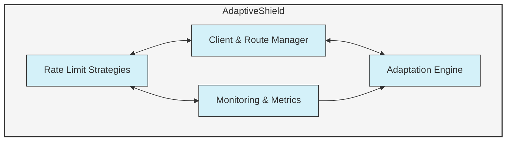

# AdaptiveShield: Advanced Adaptive Rate Limiting System

AdaptiveShield is a sophisticated rate limiting system designed for modern microservices and APIs. It intelligently adapts to traffic patterns and offers multiple rate limiting strategies that can be combined and configured for optimal protection.

## Installation and Setup

1. Install required dependencies:
```bash
pip install -r requirements.txt
```

2. Redis Setup (required for distributed mode):
```bash
# Option 1: Using Docker
docker run -d -p 6379:6379 redis

# Option 2: Local Redis installation
# Follow instructions at https://redis.io/docs/getting-started/
```

## Running the System Components

### Core Examples

1. FastAPI Example (Basic):
```bash
python example_service.py
# Access at http://localhost:8000
```

2. Distributed Rate Limiting with Redis:
```bash
python distributed_example.py
# Access at http://localhost:5001
```

3. Monitoring Dashboard:
```bash
python dashboard.py
# Access at http://localhost:8050
```

4. Run All Examples:
```bash
python run_examples.py
```

### Testing and Evaluation

1. Benchmark Different Strategies:
```bash
python benchmark.py
```

2. Load Testing:
```bash
python benchmark.py --load-test --duration 60
```

## Component Architecture

AdaptiveShield consists of several key components:

1. **Core Shield Library** - Implements various rate limiting strategies
2. **FastAPI/Flask Integration** - Examples showing integration with web frameworks
3. **Distributed Implementation** - Redis-based coordination for multi-instance deployments
4. **Monitoring Dashboard** - Real-time visualization and configuration UI
5. **Benchmarking Tools** - Performance testing and strategy comparison

## Rate Limiting Strategies

| Strategy | Description | Best For |
|----------|-------------|----------|
| Token Bucket | Allows bursts while maintaining average rate | General purpose, API endpoints with occasional bursts |
| Sliding Window | More accurate than fixed windows, less memory than sliding logs | High precision counting, smooth limiting |
| Leaky Bucket | Ensures constant outflow rate | Protecting downstream services, steady traffic flow |
| Adaptive Window | Dynamically adjusts based on traffic patterns | Varying workloads, systems with changing traffic patterns |

## System Requirements

- Python 3.7+
- Redis (for distributed mode)
- 512MB RAM minimum (2GB recommended for running all components)
- Operating Systems: Linux, macOS, Windows

## Verification Steps

1. Check examples are working:
   - FastAPI example should return JSON responses at http://localhost:8000
   - Dashboard should display metrics at http://localhost:8050
   - Distributed example should be accessible at http://localhost:5001

2. Test rate limiting:
   - Run `python run_examples.py --test-limits`
   - Observe 429 status codes when limits are exceeded

3. Monitor adaptation:
   - Run system with high traffic then observe in dashboard how limits adjust
   - Adaptation visible in both metrics and configuration panels

## Troubleshooting

- If Redis connection fails, ensure Redis is running and accessible on port 6379
- For visualization issues, ensure all Dash/Plotly dependencies are installed
- Port conflicts can be resolved by editing the port numbers in each example file

## Architecture

AdaptiveShield uses a layered architecture to provide flexibility and performance:



## Metrics and Monitoring

AdaptiveShield provides comprehensive metrics:

### Global Stats

```python
global_stats = shield.get_global_stats()
```

Returns information like:
- Total requests processed
- Allowed vs. rejected requests
- Current traffic rate
- Rejection rate

### Client Stats

```python
client_stats = shield.get_client_stats("client_123")
```

Returns client-specific metrics including:
- Request history
- Allowed/rejected counts
- Current rate limiting status
- Token/window information based on strategy

### Route Stats

```python
route_stats = shield.get_route_stats("/api/users")
```

Provides route-specific analytics including:
- Traffic patterns for the route
- Effectiveness of the applied strategy
- Current configuration

## Advanced Features

### Automatic Adaptation

When enabled, AdaptiveShield monitors traffic patterns and adjusts limits automatically:

```python
shield = AdaptiveShield(
    default_limit=100,
    default_window=60,
    auto_adapt=True,  
    monitor_interval=30 
)
```

### Distributed Rate Limiting

For scalable applications running multiple instances, use the Redis backend:

```python
from adaptive_shield.distributed import RedisAdaptiveShield
import redis

redis_client = redis.Redis(host='localhost', port=6379)

shield = RedisAdaptiveShield(
    redis_client=redis_client,
    key_prefix="my_app",
    default_limit=100,
    default_window=60
)
```

### Custom Client Identification

Implement your own client identification logic:

```python
def get_client_id(request):
    api_key = request.headers.get("X-API-Key")
    if api_key:
        return f"api:{api_key}"
    
    ip = request.remote_addr
    agent = request.headers.get("User-Agent", "")
    return f"ip:{ip}:{hash(agent)}"
```

## Running the Examples

```bash
python flask_example.py

python example_service.py

python benchmark.py --clients 10 --rps 50 --load-pattern spike

python dashboard.py

python distributed_example.py
```

## Deployment Considerations

### High Availability

For distributed environments, consider using the Redis backend to maintain consistent rate limiting across multiple instances. See `distributed_example.py` for details.

### Performance

AdaptiveShield is designed for high performance:
- In-memory storage for fast lookups
- Efficient algorithms with minimal overhead
- Threaded monitoring to avoid blocking the request path
- Redis Lua scripts for atomic distributed operations

## License

This project is licensed under the MIT License - see the LICENSE file for details.

## Contributing

Contributions are welcome! Please feel free to submit a Pull Request. 