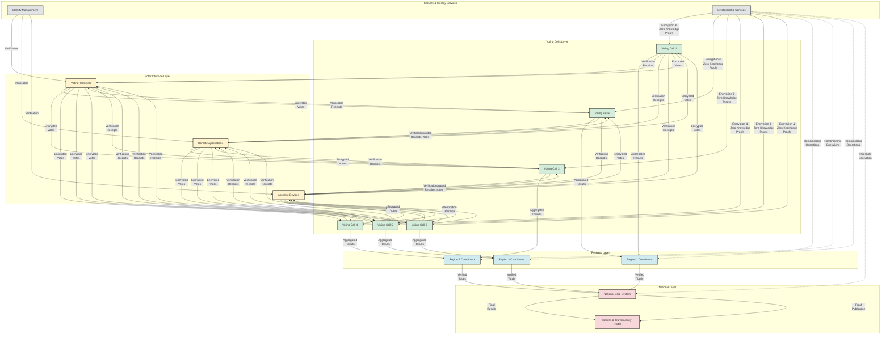
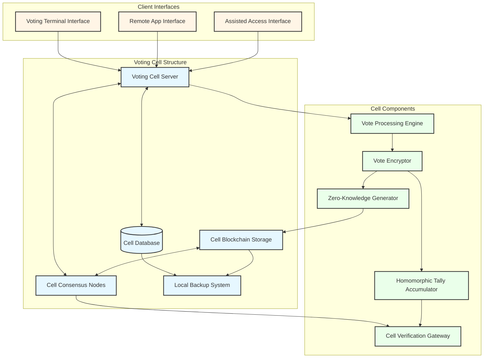
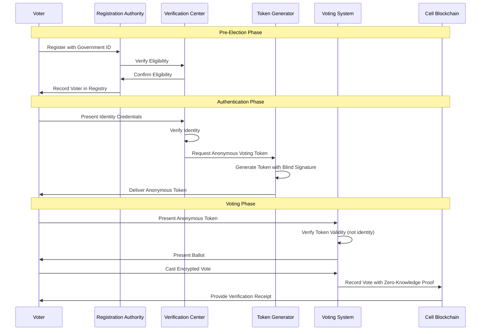
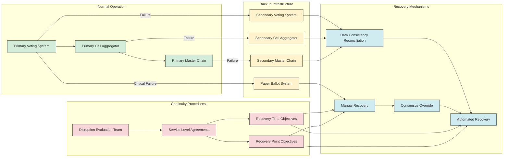

# Secure E-Voting System for National Elections

## Functional Requirements

### User Authentication and Voter Management
1. **Biometric Verification**: Support multi-factor authentication including biometric verification (fingerprint, facial recognition) and government-issued ID validation
2. **Voter Registration**: Securely register eligible voters with strict identity verification processes
3. **Accessibility Support**: Provide alternative authentication methods for voters with disabilities
4. **Voter Status Verification**: Allow voters to verify their registration status through multiple channels
5. **Identity Separation**: Ensure technical separation between voter identity and their cast ballot

### Voting Process
1. **Ballot Presentation**: Display official ballot designs with candidate information, party affiliations, and voting instructions
2. **Vote Selection**: Enable intuitive selection of candidates or referendum choices
3. **Vote Verification**: Provide on-screen verification before final submission
4. **Vote Confirmation**: Generate cryptographic receipt for voters without revealing their selections
5. **Multiple Voting Channels**: Support in-person e-voting at polling stations and secure remote voting
6. **Vote Modification**: Allow voters to change their vote before final submission deadline

### Election Management
1. **Election Configuration**: Define election parameters including dates, constituencies, candidates, and ballot design
2. **Voting Period Control**: Enforce strict voting period start and end times across all time zones
3. **Real-time Monitoring**: Provide election officials with real-time statistics on voting participation (not results)
4. **Incident Management**: Detect and address technical issues, suspicious activities, or voter assistance needs
5. **Results Tabulation**: Accurately count and tabulate votes after polls close
6. **Results Publication**: Generate official election results reports with comprehensive verification data

### Auditing and Transparency
1. **Vote Verification**: Allow voters to verify their vote was correctly recorded and counted
2. **Election Observation**: Provide secure access for authorized observers to monitor voting process
3. **System Audit Logs**: Maintain comprehensive, tamper-proof audit logs of all system activities
4. **Public Verifiability**: Publish cryptographic proofs that enable verification of election integrity
5. **Statistical Analysis**: Generate anonymized statistical reports for election analysis

## Non-Functional Requirements

### Performance and Scalability
1. **Concurrent Users**: Support up to 50 million concurrent voters during peak periods
2. **Response Time**: Maintain sub-3-second response time for 99% of voting transactions
3. **Transaction Rate**: Process at least 5,000 complete voting transactions per second
4. **Geographic Distribution**: Support geographically distributed voting from all regions of the country
5. **Scalable Architecture**: Dynamically scale to accommodate varying loads across different regions

### Security and Integrity
1. **End-to-End Encryption**: Implement end-to-end encryption for all transmitted data
2. **Vote Secrecy**: Ensure mathematical impossibility of linking voters to their specific votes
3. **Tamper Resistance**: Prevent modification of votes after submission
4. **Intrusion Protection**: Implement advanced protection against cyber attacks (DDoS, penetration attempts)
5. **Physical Security**: Secure all physical infrastructure components against unauthorized access
6. **Post-Quantum Security**: Employ cryptographic algorithms resistant to quantum computing attacks

### Availability and Reliability
1. **System Uptime**: Maintain 99.999% uptime during official voting period (maximum 26 seconds downtime)
2. **Data Durability**: Ensure zero vote data loss through redundant storage and backup mechanisms
3. **Fault Tolerance**: Continue operation despite failure of multiple system components
4. **Disaster Recovery**: Recover from catastrophic failures within 10 minutes without data loss
5. **Offline Capability**: Provide paper ballot backup in case of complete system failure

### Privacy and Anonymity
1. **Voter Anonymity**: Maintain absolute separation between voter identity and ballot content
2. **Data Protection**: Comply with international privacy standards and data protection regulations
3. **Minimal Data Collection**: Collect only essential data required for voting functionality
4. **Secure Disposal**: Implement proper data destruction protocols after statutory retention periods

### Verifiability and Transparency
1. **Individual Verifiability**: Allow each voter to verify their own vote was correctly recorded
2. **Universal Verifiability**: Enable public verification that all votes were correctly counted
3. **Audit Mechanisms**: Support independent audits without compromising vote secrecy
4. **Open Protocols**: Publish cryptographic protocols and verification mechanisms
5. **Transparent Code**: Open-source core cryptographic components for public review

### Usability and Accessibility
1. **Intuitive Interface**: Provide a simple, intuitive voting interface requiring minimal training
2. **Accessibility Compliance**: Meet WCAG 2.1 Level AA standards for accessibility
3. **Multiple Languages**: Support all official national languages and recognized minority languages
4. **Voter Assistance**: Provide secure help mechanisms for voters requiring assistance
5. **Diverse Platforms**: Support various device types (dedicated terminals, tablets, personal computers)

## System Architecture Overview

The proposed e-voting system implements a hierarchical cellular architecture that balances security, scalability, and verifiability while ensuring vote privacy and system resilience.

The architecture features five primary layers:

1. **Voter Interface Layer**: The entry points where voters interact with the system, including physical voting terminals in polling stations, secure remote applications, and specialized assistive devices for voters with disabilities.

2. **Voting Cells Layer**: The core processing units that handle vote collection, encryption, and verification. Each cell serves a limited geographic area (50,000-200,000 voters) and operates an independent blockchain to record encrypted votes.

3. **Regional Layer**: Coordinators that aggregate and verify results from multiple voting cells. They perform inter-cell consistency checks without decrypting individual votes, using homomorphic operations.

4. **National Layer**: The final aggregation point that produces official results after threshold cryptographic operations. This layer includes transparency mechanisms for public verification.

5. **Security & Identity Services**: Cross-cutting services that provide authentication, encryption, and cryptographic proof generation. These services ensure vote secrecy and system integrity throughout all layers.

This cellular design provides inherent scalability, resilience, and security by compartmentalizing the electorate while maintaining cryptographic verifiability across the entire system.

## Core System Components

### 1. Cellular Architecture Design

The system divides the electorate into "voting cells" - manageable units typically aligned with electoral districts or precincts. Each cell operates its own independent blockchain for vote collection and verification:

Each voting cell:
- Processes votes from 50,000-200,000 voters
- Operates its own permissioned blockchain with 7+ validator nodes
- Runs independent of other cells during voting periods
- Maintains local records that later aggregate at the regional level

This approach provides significant advantages:
- **Horizontal Scalability**: Add more cells to increase capacity without degrading performance
- **Fault Containment**: Issues in one cell don't affect others
- **Reduced Consensus Overhead**: Smaller validator sets improve transaction throughput
- **Geographic Resilience**: Naturally maps to electoral geography

### 2. Identity Management and Privacy

The system employs a strict separation between voter authentication and vote content through:

1. **Identity-Vote Separation**: Authentication and voting are distinct processes
2. **Blind Signature Protocol**: Authorities sign voting permissions without seeing the voter's choices
3. **Anonymous Voting Tokens**: One-time cryptographic credentials authorize voting without revealing identity
4. **Multi-layered Authentication**: Combines biometric verification, government ID, and personal credentials

### 3. End-to-End Verification Flow

```mermaid
flowchart LR
    subgraph "Cast-as-Intended"
        BPD[Ballot Presentation Display]
        USI[User Selection Interface]
        SRV[Selection Review View]
        VCM[Vote Confirmation Mechanism]
    end
    
    subgraph "Recorded-as-Cast"
        VRP[Vote Receipt Provider]
        VIM[Vote Inclusion Mechanism]
        BCG[Blockchain Gateway]
        MPG[Merkle Proof Generator]
    end
    
    subgraph "Counted-as-Recorded"
        HTM[Homomorphic Tally Mechanism]
        PVC[Public Verification Checker]
        PMP[Proof Matching Portal]
        ZKV[Zero-Knowledge Verifier]
    end
    
    BPD --> USI
    USI --> SRV
    SRV --> VCM
    
    VCM --> VRP
    VRP --> VIM
    VIM --> BCG
    BCG --> MPG
    
    MPG --> HTM
    HTM --> PVC
    PVC --> PMP
    PMP --> ZKV
    
    %% Styling
    classDef cast fill:#ffe6cc,stroke:#333,stroke-width:1px
    classDef recorded fill:#cce6ff,stroke:#333,stroke-width:1px
    classDef counted fill:#d9f2d9,stroke:#333,stroke-width:1px
    
    class BPD,USI,SRV,VCM cast
    class VRP,VIM,BCG,MPG recorded
    class HTM,PVC,PMP,ZKV counted
```

The system provides full verifiability while preserving vote secrecy through:

1. **Cast-as-Intended Verification**: Voters confirm their selections on screen before submission
2. **Recorded-as-Cast Verification**: Voters receive cryptographic receipts proving their vote was correctly recorded
3. **Counted-as-Recorded Verification**: Public verification that all recorded votes were included in the final tally
4. **Homomorphic Tally Verification**: Mathematical proofs that votes were correctly tallied without decryption

### 4. Secure Data Flow Architecture

```mermaid
flowchart TD
    subgraph "Data Zones"
        subgraph "Public Zone"
            LP[Load Balancers]
            WAF[Web Application Firewall]
            DDoS[DDoS Protection]
        end
        
        subgraph "Authentication DMZ"
            IDGW[Identity Gateway]
            MFA[Multi-Factor Auth]
            BAP[Biometric Auth Provider]
            TIS[Token Issuance Service]
        end
        
        subgraph "Voting Zone"
            VSG[Vote Submission Gateway]
            VPS[Vote Processing Service]
            VES[Vote Encryption Service]
            BCS[Blockchain Service]
        end
        
        subgraph "Aggregation Zone"
            AGG[Aggregation Service]
            HTS[Homomorphic Tally Service]
            MDS[Metadata Service]
            BSI[Blockchain State Interface]
        end
        
        subgraph "Verification Zone"
            VVS[Vote Verification Service]
            ERS[Election Results Service]
            AUD[Audit Service]
            AAP[Anonymous Analytics Provider]
        end
        
        subgraph "Secure Storage Zone"
            IAD[(Identity & Auth Data)]
            EVS[(Encrypted Vote Store)]
            BLS[(Blockchain Ledger Storage)]
            ALS[(Audit Log Storage)]
        end
    end
    
    %% Data flow connections
    LP --> WAF --> DDoS
    DDoS --> IDGW & VSG
    
    IDGW --> MFA --> BAP
    BAP --> TIS
    TIS --> IAD
    
    VSG --> VPS --> VES
    VES --> BCS --> BLS
    
    BCS --> AGG
    BLS --> BSI
    BSI --> AGG
    AGG --> HTS --> MDS
    
    BLS --> VVS
    VVS --> ERS
    VVS & ERS --> AUD
    AUD --> AAP
    
    MFA -.-> IAD
    VES -.-> EVS
    AGG -.-> EVS
    AUD -.-> ALS
    
    %% Styling
    classDef public fill:#f9f9f9,stroke:#333,stroke-width:1px
    classDef auth fill:#ffffcc,stroke:#333,stroke-width:1px
    classDef voting fill:#ccffcc,stroke:#333,stroke-width:1px
    classDef agg fill:#ccccff,stroke:#333,stroke-width:1px
    classDef verify fill:#ffcccc,stroke:#333,stroke-width:1px
    classDef storage fill:#e6e6e6,stroke:#333,stroke-width:1px
    
    class LP,WAF,DDoS public
    class IDGW,MFA,BAP,TIS auth
    class VSG,VPS,VES,BCS voting
    class AGG,HTS,MDS,BSI agg
    class VVS,ERS,AUD,AAP verify
    class IAD,EVS,BLS,ALS storage
```

### 5. Multi-Layered Security Architecture

```mermaid
flowchart TD
    subgraph "Security Layers"
        subgraph "Physical Security"
            SC[Secure Computing Facilities]
            PS[Physical Surveillance]
            AC[Access Controls]
            TS[Tamper-evident Seals]
            HSM[Hardware Security Modules]
        end
        
        subgraph "Network Security"
            FW[Firewalls]
            IPS[Intrusion Prevention]
            NSM[Network Segmentation]
            TLS[TLS 1.3 Encryption]
            AGN[Air-gapped Networks]
        end
        
        subgraph "Application Security"
            IAM[Identity & Access Management]
            RBAC[Role-based Access Control]
            SA[Security Audits]
            PT[Penetration Testing]
            SAST[Static Code Analysis]
        end
        
        subgraph "Data Security"
            E2EE[End-to-End Encryption]
            HE[Homomorphic Encryption]
            ZKP[Zero-Knowledge Proofs]
            PQC[Post-Quantum Cryptography]
            KMS[Key Management System]
        end
        
        subgraph "Operational Security"
            SDP[Separation of Duties]
            CM[Configuration Management]
            PM[Patch Management]
            IR[Incident Response]
            BCP[Business Continuity Planning]
        end
    end
    
    %% Security relationships
    SC --> AC
    AC --> HSM
    PS --> TS
    
    SC --> AGN
    AGN --> FW
    FW --> IPS
    IPS --> NSM
    NSM --> TLS
    
    TLS --> IAM
    IAM --> RBAC
    SAST --> SA
    SA --> PT
    
    PT --> E2EE
    E2EE --> HE
    HE --> ZKP
    ZKP --> PQC
    PQC --> KMS
    
    KMS --> SDP
    SDP --> CM
    CM --> PM
    PM --> IR
    IR --> BCP
    
    %% Styling
    classDef physical fill:#f9d6d2,stroke:#333,stroke-width:1px
    classDef network fill:#d2f9d6,stroke:#333,stroke-width:1px
    classDef app fill:#d2d6f9,stroke:#333,stroke-width:1px
    classDef data fill:#f9f9d2,stroke:#333,stroke-width:1px
    classDef ops fill:#d6d2f9,stroke:#333,stroke-width:1px
    
    class SC,PS,AC,TS,HSM physical
    class FW,IPS,NSM,TLS,AGN network
    class IAM,RBAC,SA,PT,SAST app
    class E2EE,HE,ZKP,PQC,KMS data
    class SDP,CM,PM,IR,BCP ops
```

The system employs a defense-in-depth security approach that implements multiple protective layers:

1. **Physical Security**: Secure facilities, hardware security modules, tamper-evident seals, and biometric access controls
2. **Network Security**: Multi-tier network architecture with segmentation, TLS 1.3 encryption, and air-gapped critical systems
3. **Application Security**: Regular security audits, penetration testing, and strong authentication mechanisms
4. **Data Security**: Post-quantum cryptographic algorithms, homomorphic encryption, and zero-knowledge proofs
5. **Operational Security**: Separation of duties, formal verification of protocols, and strict procedural controls

## Homomorphic Vote Tallying System

```mermaid
flowchart TB
    subgraph "Key Generation"
        KG[Key Generation Ceremony]
        CDA[Custodian Distribution Algorithm]
        DKS[Distributed Key Shares]
        PKG[Public Key Generation]
        PKD[Public Key Distribution]
    end
    
    subgraph "Encrypted Vote Casting"
        VE[Vote Encryption]
        VP[Vote Packaging]
        ZKG[Zero-Knowledge Proofs]
        BV[Ballot Validation]
        BS[Blockchain Storage]
    end
    
    subgraph "Homomorphic Operations"
        VR[Vote Retrieval]
        HAL[Homomorphic Addition Layer]
        BPM[Bulletin Proof Mechanism]
        VSP[Verification Side-Process]
    end
    
    subgraph "Threshold Decryption"
        ASM[Authority Security Mechanisms]
        PDV[Partial Decryption Validators]
        PDP[Proof of Decryption Process]
        DCR[Decryption Reconstruction]
    end
    
    subgraph "Result Publication"
        RCG[Result Certification Gateway]
        PKI[Public Knowledge Interface]
        PVM[Proof Verification Mechanism]
        ARL[Auditable Result Log]
    end
    
    %% Flow connections
    KG --> CDA
    CDA --> DKS
    DKS --> PKG
    PKG --> PKD
    
    PKD --> VE
    VE --> VP
    VP --> ZKG
    ZKG --> BV
    BV --> BS
    
    BS --> VR
    VR --> HAL
    HAL --> BPM
    BPM --> VSP
    
    VSP --> ASM
    ASM --> PDV
    PDV --> PDP
    PDP --> DCR
    
    DCR --> RCG
    RCG --> PKI
    PKI --> PVM
    PVM --> ARL
    
    %% Styling
    classDef keygen fill:#f0fff0,stroke:#333,stroke-width:1px
    classDef vote fill:#fff0f0,stroke:#333,stroke-width:1px
    classDef homo fill:#f0f0ff,stroke:#333,stroke-width:1px
    classDef decrypt fill:#fffff0,stroke:#333,stroke-width:1px
    classDef publish fill:#fff0ff,stroke:#333,stroke-width:1px
    
    class KG,CDA,DKS,PKG,PKD keygen
    class VE,VP,ZKG,BV,BS vote
    class VR,HAL,BPM,VSP homo
    class ASM,PDV,PDP,DCR decrypt
    class RCG,PKI,PVM,ARL publish
```

The system uses homomorphic encryption to enable secure tallying without decrypting individual votes:

1. **Homomorphic Property**: Encrypted votes can be mathematically combined without decryption
2. **Mathematical Validation**: Operations on encrypted votes yield the same result as operations on plaintext votes
3. **Threshold Authority**: Final tally decryption requires multiple independent authorities
4. **Cryptographic Verification**: Mathematical proofs verify the correctness of operations without revealing votes

## Disaster Recovery and Business Continuity

The system is designed to continue operation even during severe disruptions:

1. **Graceful Degradation**: System components can operate in reduced functionality mode during partial failures
2. **Geographic Redundancy**: Critical infrastructure components deployed across multiple physical locations
3. **Multi-modal Fallback**: Ability to switch between online, offline, and paper-based voting modes
4. **Transparent Recovery**: All recovery operations maintain verifiability and audit trails
5. **Predefined Continuity Procedures**: Clear processes for different failure scenarios

## Key Trade-offs and Mitigations

### Trade-off 1: Security vs. Usability

**Challenge**: Enhanced security measures often reduce system usability and increase complexity.

**Mitigation Strategy**:
- User-centered design with extensive usability testing
- Progressive security approach based on threat context
- Clear, simple voter interfaces that hide underlying complexity
- Extensive voter education programs and simulation opportunities
- Assisted voting options with strict procedural controls

### Trade-off 2: Transparency vs. Confidentiality

**Challenge**: Complete transparency can compromise vote secrecy, while absolute confidentiality limits verifiability.

**Mitigation Strategy**:
- Zero-knowledge proofs to verify processes without revealing sensitive data
- Homomorphic encryption to enable computation on encrypted votes
- Separation of duties across multiple independent authorities
- Public verification protocols that don't expose individual votes
- Statistical audits that preserve voter anonymity

### Trade-off 3: Centralization vs. Distribution

**Challenge**: Centralized systems offer consistency and control but create single points of failure.

**Mitigation Strategy**:
- Cellular architecture dividing the electorate into manageable units
- Independent operation capability for each voting cell
- Hierarchical aggregation with cross-verification
- Distributed authority requiring consensus for critical operations
- Regional autonomy with national coordination

### Trade-off 4: Performance vs. Verification Depth

**Challenge**: Comprehensive verification increases computational requirements and reduces performance.

**Mitigation Strategy**:
- Optimized cryptographic implementations for core operations
- Tiered verification with rapid preliminary checks and deeper post-election verification
- Parallel processing for verification operations
- Hardware acceleration for cryptographic functions
- Intelligent load distribution to prevent system overload

## Implementation and Deployment Plan

The implementation follows a phased approach to ensure reliability and build public trust:

### Phase 1: Foundation (6-12 months)
- Develop core cryptographic components and protocols
- Establish security frameworks and standards
- Create reference implementations and testing environments
- Conduct security reviews and formal verification
- Engage with election authorities and stakeholders

### Phase 2: Controlled Pilots (12-18 months)
- Deploy in limited local elections with parallel paper balloting
- Test with diverse voter demographics and conditions
- Conduct thorough security audits and penetration testing
- Collect and incorporate feedback on usability and performance
- Refine protocols and implementation based on real-world experience

### Phase 3: Scaled Deployment (18-24 months)
- Deploy for regional elections with increased voter participation
- Implement full-scale infrastructure with production security controls
- Train election officials and technical support personnel
- Establish monitoring and incident response capabilities
- Conduct public education and awareness campaigns

### Phase 4: National Implementation (24-36 months)
- Deploy complete system for national elections
- Implement comprehensive monitoring and support operations
- Maintain parallel paper ballot capability as contingency
- Provide international observation and verification access
- Establish continuous improvement processes

## Conclusion

This secure e-voting system design addresses the requirements for transitioning from paper-based to electronic voting while ensuring the highest standards of security, transparency, and accessibility. By employing a cellular blockchain architecture with post-quantum cryptography and zero-knowledge proofs, the system provides strong guarantees of vote integrity and voter privacy.

The proposed implementation balances competing concerns through a thoughtful architecture that separates identity verification from vote content, enables end-to-end verification, and maintains multiple security layers. The phased deployment approach allows for building public confidence through demonstrated reliability in increasingly significant elections.

With appropriate implementation of this design, a nation can conduct secure, verifiable electronic elections at scale while preserving the fundamental democratic principles of ballot secrecy, universal access, and trusted results. 