# MESA: Mesh-Enabled Sovereign Aid
## Decentralized Humanitarian Assistance Distribution System

---

## 1. Executive Summary

MESA (Mesh-Enabled Sovereign Aid) introduces a paradigm shift in humanitarian aid distribution by combining mesh networking, sovereign identity principles, and trust circles to create a system that functions effectively in the most challenging environments. Unlike conventional centralized approaches, MESA operates on a "neighborhood-first" architecture inspired by natural resilient systems like mycelial networks, creating an organically expanding aid distribution infrastructure that works offline by default while maintaining data integrity, privacy, and recipient dignity.

The system addresses the critical challenges of humanitarian aid distribution:
- Eliminating aid duplication and fraud without requiring constant connectivity
- Functioning in regions with unreliable or non-existent infrastructure
- Preserving recipient privacy and data ownership
- Creating cross-organization compatibility
- Building trust without centralized authority

By shifting from a hierarchical to a mesh-based approach, MESA creates a solution uniquely suited to the chaotic nature of humanitarian crises.

---

## 2. Core Challenges in Humanitarian Aid Distribution

### 2.1 Current State Analysis

Humanitarian aid distribution currently faces several critical challenges:

1. **Identity Verification Issues**: 
   - Lack of official identity documentation
   - Unreliable existing ID systems
   - Privacy concerns with centralized biometric systems

2. **Operational Challenges**:
   - Intermittent or non-existent connectivity
   - Duplication of aid across organizations
   - Fraud and misappropriation
   - Difficulty tracking actual delivery to intended recipients

3. **Trust and Transparency Gaps**:
   - Limited visibility into equitable distribution
   - Difficulty coordinating between multiple aid organizations
   - Lack of recipient agency and data ownership
   - Inability to audit without centralized systems

### 2.2 Limitations of Conventional Approaches

Traditional approaches typically rely on:
- Centralized databases requiring constant synchronization
- Paper-based fallback systems prone to fraud
- Temporary ID systems that don't persist between crises
- Proprietary systems that don't interoperate between organizations

These approaches fail in the most challenging scenarios precisely when aid is most needed.

---

## 3. MESA's Unique Approach: Mycelial Trust Networks

MESA draws inspiration from nature's most resilient distribution systems – mycelial networks – which transport nutrients through robust, redundant pathways without central coordination. This biomimetic approach creates an aid distribution system that can:

- **Self-organize** without central authority
- **Self-heal** when parts of the network are damaged
- **Adapt** to changing conditions on the ground
- **Preserve trust** through multiple verification pathways
- **Operate offline** while maintaining data integrity

### 3.1 Core Principles

MESA is built on five foundational principles:

1. **Sovereign Identity**: Recipients own their identity and control their data
2. **Mesh-First Design**: Offline operation as the default state
3. **Trust Circles**: Replacing central authority with community verification
4. **Asynchronous Consensus**: Building agreement without constant connectivity
5. **Progressive Enhancement**: Starting with minimal capabilities and expanding as infrastructure improves

### 3.2 System Overview

MESA encompasses:

1. **Mesh Field Units**: Ruggedized devices carried by aid workers with local storage, mesh networking, and biometric capabilities
2. **Community Trust Nodes**: Semi-permanent installations at camps or community centers
3. **Sovereign Identity Tokens**: Physical tokens (cards or wearables) with secure elements
4. **Sync Stations**: Connectivity points that synchronize with broader networks when available
5. **Federation Layer**: Interoperability protocols between aid organizations

---

## 4. Functional Requirements

### 4.1 Identity Establishment and Verification

#### 4.1.1 Multi-Modal Identification
- Biometric options including fingerprint, facial, and iris recognition
- Configurable based on cultural/religious considerations and recipient consent
- Alternative pathways for those unable to provide biometrics (disability accommodations)

#### 4.1.2 Community Attestation System
- Trust circle formation with 3-5 individuals cross-vouching for identity
- Community elder/leader verification options
- Family unit linking with privacy preservation

#### 4.1.3 Sovereign Identity Creation
- Generation of cryptographic key pairs for each recipient
- Binding biometrics to sovereign identity with zero-knowledge proofs
- Physical token issuance with secure element for offline verification

### 4.2 Aid Registration and Distribution

#### 4.2.1 Aid Eligibility and Entitlement
- Customizable eligibility criteria per program
- Entitlement calculation based on household size and vulnerability
- Special needs registration and accommodation
- Cross-program eligibility verification without data sharing

#### 4.2.2 Distribution Point Operations
- Offline verification of identity and entitlement
- Multi-signature confirmation of aid delivery
- Receipt generation with cryptographic proof
- Real-time inventory management on field units

#### 4.2.3 Voucher and Cash-Based Assistance
- Secure voucher generation with anti-counterfeiting measures
- Cash distribution tracking
- Digital wallet integration where appropriate
- Verification of exchange (vouchers for goods)

### 4.3 Transparency and Auditing

#### 4.3.1 Aid Journey Tracking
- Cryptographic sealing of aid packages
- Chain of custody tracking
- Last-mile delivery confirmation
- Recipient acknowledgment system

#### 4.3.2 Equitable Distribution Monitoring
- Geographic distribution visualization
- Demographic allocation analysis
- Gap identification and alerting
- Time-to-aid measurement

#### 4.3.3 Immutable Audit Trail
- Cryptographically secured logs of all transactions
- Tamper-evident history
- Privacy-preserving analytics
- Donor transparency reporting

### 4.4 Recipient Data Agency

#### 4.4.1 Recipient Portal
- Personal aid history access
- Data sharing consent management
- Communications preferences
- Feedback submission

#### 4.4.2 Cross-Program Identity Use
- Selective disclosure capabilities
- Organization-specific pseudonymous identifiers
- Programmatic consent for data sharing
- Revocation mechanisms

### 4.5 Field Operations Support

#### 4.5.1 Offline-First Workflows
- Complete functioning without connectivity
- Local decision support
- Prioritized synchronization when connectivity returns
- Conflict resolution protocols

#### 4.5.2 Field Worker Tools
- Simplified registration workflows
- Distribution checklists
- Exception handling procedures
- Urgent case flagging

---

## 5. Technical Architecture

### 5.1 Physical Layer Components

#### 5.1.1 Mesh Field Units (MFUs)
- Ruggedized tablets with integrated peripherals
- Solar charging capabilities
- Local storage (512GB-1TB)
- Bluetooth and WiFi direct for mesh networking
- Optional satellite connectivity modules
- Attached peripheral suite:
  - Fingerprint scanner
  - High-resolution camera
  - RFID/NFC reader for tokens
  - Thermal printer for receipts

#### 5.1.2 Community Trust Nodes (CTNs)
- Solar-powered stationary units
- Extended range mesh networking (1-3km)
- Local database replicas
- E-ink community bulletin displays
- Physical security measures

#### 5.1.3 Sovereign Identity Tokens
- Secure element smartcards (primary option)
- NFC wearable alternatives
- Visual backup codes for token loss scenarios
- Tamper-evident design

#### 5.1.4 Sync Stations
- Satellite or cellular backhaul
- High-capacity local storage
- Scheduled synchronization capabilities
- Strong encryption for data in transit

### 5.2 Software Architecture

#### 5.2.1 Distributed Data Model

MESA employs a Conflict-free Replicated Data Type (CRDT) based distributed database that enables:
- Functional offline operations
- Eventual consistency when synchronized
- Automatic conflict resolution
- Cryptographic verification of data integrity

Data is categorized into:
- **Identity attestations**: Immutable cryptographic proofs
- **Entitlement records**: Append-only logs with cryptographic linking
- **Distribution events**: Signed multi-party confirmations
- **Inventory tracking**: Reconcilable assets with audit trails

#### 5.2.2 Mesh Network Protocol

The MESA Resilient Mesh Protocol features:
- Store-and-forward message passing
- Opportunistic synchronization
- Priority-based data transmission
- Bandwidth-aware compression
- Partial synchronization capabilities

#### 5.2.3 Cryptographic Framework

The system utilizes:
- **Threshold signatures**: Requiring multiple parties for sensitive operations
- **Zero-knowledge proofs**: For privacy-preserving verification
- **Verifiable delay functions**: Preventing certain forms of manipulation
- **Post-quantum cryptographic alternatives**: For long-term security

#### 5.2.4 Sovereign Identity Implementation

Based on:
- Decentralized Identifiers (DIDs) standard
- Verifiable Credentials data model
- Capability-based security model
- Key rotation and recovery mechanisms

#### 5.2.5 Trust Establishment Mechanism

MESA replaces central authority trust with:
- **Web of Trust model**: Cross-attestations between individuals
- **Organizational attestations**: From recognized aid agencies
- **Community consensus**: Threshold verification by community members
- **Historical continuity**: Building trust through consistent identification over time

### 5.3 Data Architecture

#### 5.3.1 Core Data Entities

1. **Person Registry**
   - Biometric templates (locally encrypted)
   - Demographic information (age range, household size)
   - Special needs/vulnerabilities
   - Trust circle references

2. **Aid Program Definitions**
   - Eligibility criteria
   - Entitlement calculations
   - Disbursement schedules
   - Responsible organizations

3. **Distribution Events**
   - What was provided
   - When and where distribution occurred
   - Verification signatures
   - Inventory references

4. **Resource Tracking**
   - Available inventory
   - Allocation plans
   - Expiration tracking
   - Loss/damage records

#### 5.3.2 Privacy and Security Model

1. **Data Minimization**
   - Collection of only essential information
   - Age ranges rather than exact dates
   - Location zones rather than exact coordinates

2. **Compartmentalization**
   - Separation of identity from distribution data
   - Organization-specific pseudonymous identifiers
   - Need-to-know access controls

3. **Encryption Strategy**
   - Local encryption of all sensitive data
   - Multi-key encryption for shared data
   - Forward secrecy for communications

### 5.4 Synchronization Architecture

#### 5.4.1 Local-First Synchronization

1. **Field Unit to Field Unit**
   - Proximity-based sync when units come within range
   - Prioritized sync of essential verification data
   - Bandwidth-aware transmission

2. **Field Unit to Trust Node**
   - Regular synchronization when in range
   - Complete metadata sync
   - Partial biometric template sync based on need

#### 5.4.2 Network Synchronization

1. **Trust Node to Sync Station**
   - Scheduled bulk synchronization
   - Compressed deltas of changes
   - Cryptographic verification of transmitted data

2. **Sync Station to Federation Layer**
   - Cross-organizational summary data
   - Anonymized distribution statistics
   - Duplicate aid checking with privacy preservation

#### 5.4.3 Conflict Resolution

1. **Detection Mechanisms**
   - Versioned records with vector clocks
   - Cryptographic integrity verification
   - Anomaly detection for potentially fraudulent conflicts

2. **Resolution Strategies**
   - Multi-witness verification for conflicting claims
   - Rule-based automatic resolution for non-critical conflicts
   - Flagging system for human review of significant discrepancies

---

## 6. Non-Functional Requirements

### 6.1 Performance Requirements

1. **Registration Efficiency**
   - Complete new registration in <5 minutes
   - Identity verification in <15 seconds
   - Support for batch registration of family units

2. **Distribution Speed**
   - Aid verification and recording in <30 seconds per recipient
   - Support for 2,000+ recipients per distribution point per day
   - Batch operations for group distributions

3. **Synchronization Performance**
   - Field unit to field unit sync: 1,000 records in <5 minutes
   - Complete trust node sync in <2 hours even with limited bandwidth
   - Incremental syncs completing in <15 minutes

### 6.2 Scalability Requirements

1. **Capacity Scaling**
   - Support for 10+ million recipients per deployment
   - Up to 500 field units per region
   - Up to 100 trust nodes per region
   - Up to 20 synchronization stations per deployment

2. **Geographic Scaling**
   - Cross-region identity verification
   - Multiple crisis zone support
   - Global federation layer

3. **Organizational Scaling**
   - Support for 50+ aid organizations per deployment
   - Organization-specific workflows and data policies
   - Cross-organizational coordination

### 6.3 Reliability Requirements

1. **Hardware Resilience**
   - Field units operational in -10°C to 45°C
   - IP65 rating for dust and water resistance
   - Battery life of 10+ hours under active use
   - 3+ year field deployment lifespan

2. **Data Resilience**
   - No data loss even with unit destruction
   - Automatic replication across multiple nodes
   - Recovery from catastrophic infrastructure failure

3. **Operational Continuity**
   - Graceful degradation of capabilities
   - Alternative workflows for all critical functions
   - Fallback verification methods

### 6.4 Security Requirements

1. **Threat Protection**
   - Defense against impersonation attacks
   - Protection from data tampering
   - Mitigations for denial of service
   - Safeguards against insider threats

2. **Physical Security**
   - Tamper-evident hardware
   - Remote wipe capabilities
   - Encrypted storage by default
   - Duress authentication options

3. **Recovery Capabilities**
   - Identity recovery mechanisms
   - Secure backup and restore
   - Compromise containment strategies

### 6.5 Usability Requirements

1. **Accessibility**
   - Support for low-literacy populations
   - Multiple language interfaces
   - Disability accommodations
   - Culturally sensitive design

2. **Training Requirements**
   - Field staff operational with <1 day training
   - Visual workflows and guidance
   - In-application contextual help
   - Mistake prevention and correction

3. **Environmental Adaptability**
   - Functional in low-light conditions
   - Usable while wearing protective equipment
   - Glare-resistant screens
   - Operation with limited dexterity

---

## 7. Trust Without Centralization

MESA's unique approach to establishing trust without centralized control works through several complementary mechanisms:

### 7.1 Trust Circles

Unlike conventional systems that rely on a central authority to validate identity, MESA implements "trust circles" - groups of 3-5 individuals who cross-validate each other's identity. This approach:

- Creates a web of interconnected attestations
- Requires multiple confirmations for identity establishment
- Builds resilience against collusion through graph analysis
- Makes large-scale identity fraud computationally difficult

Trust circles are strengthened by:
- Pre-existing relationship verification
- Physical co-presence during enrollment
- Biometric linkage to attestations
- Temporal consistency checks

### 7.2 Multi-Stakeholder Verification

MESA distributes trust across multiple stakeholders:

1. **Aid Workers**: Who register and verify individuals
2. **Community Leaders**: Who attest to community membership
3. **Aid Recipients**: Who verify each other through trust circles
4. **Aid Organizations**: Who validate their own distribution records

By requiring consensus across these stakeholders, no single party can compromise system integrity.

### 7.3 Cryptographic Trust Anchoring

Instead of relying on a central database for "truth," MESA anchors trust in:

- **Distributed ledgers**: Recording immutable histories of attestations
- **Threshold cryptography**: Requiring multiple parties to authorize sensitive operations
- **Zero-knowledge proofs**: Enabling verification without revealing sensitive data
- **Cross-organizational validation**: Creating consensus across independent systems

### 7.4 Trust Amplification Over Time

Trust in MESA grows stronger through:

- **Consistent identification**: Each successful identification strengthens confidence
- **Aid history consistency**: Pattern matching across distribution events
- **Community embedment**: Increasing interconnections within trust circles
- **Cross-program validation**: Verification across different aid initiatives

---

## 8. Implementation Strategy

### 8.1 Phased Deployment Approach

**Phase 1: Minimal Viable System (3 months)**
- Basic identity registration with biometrics
- Offline distribution tracking
- Essential reporting capabilities
- Limited synchronization

**Phase 2: Trust Network Establishment (6 months)**
- Trust circle implementation
- Community trust nodes
- Enhanced synchronization
- Cross-checking capabilities

**Phase 3: Federation Capabilities (12 months)**
- Cross-organization interoperability
- Advanced analytics and reporting
- Complete audit capabilities
- System-wide synchronization

**Phase 4: Full Ecosystem (18+ months)**
- Digital wallet integration
- Marketplace capabilities
- Predictive distribution planning
- Machine learning for anomaly detection

### 8.2 Pilot Deployment Model

1. **Single-Organization Pilot**
   - Controlled deployment with one aid organization
   - 5-10 field units
   - 1-2 trust nodes
   - 1,000-5,000 recipients

2. **Multi-Organization Expansion**
   - Introduction of federation capabilities
   - 3-5 partner organizations
   - 25-50 field units
   - 5-10 trust nodes
   - 10,000-50,000 recipients

3. **Regional Deployment**
   - Full regional coverage
   - 10+ organizations
   - 100+ field units
   - 25+ trust nodes
   - 100,000+ recipients

### 8.3 Technical Development Roadmap

1. **Core Infrastructure (Months 1-6)**
   - CRDT data model implementation
   - Mesh networking protocol
   - Field unit software
   - Basic synchronization

2. **Identity System (Months 3-9)**
   - Biometric subsystem
   - Trust circle implementation
   - Sovereign identity framework
   - Token management

3. **Distribution Management (Months 6-12)**
   - Aid program definitions
   - Entitlement engine
   - Distribution workflows
   - Inventory tracking

4. **Federation Layer (Months 9-18)**
   - Cross-organization protocols
   - Metadata synchronization
   - Privacy-preserving lookups
   - Global deduplication

### 8.4 Sustainability Considerations

1. **Technical Sustainability**
   - Open-source core components
   - Documented APIs and protocols
   - Modular architecture for component replacement
   - Technology refresh cycles

2. **Operational Sustainability**
   - Local capacity building
   - Train-the-trainer program
   - Remote support capabilities
   - Knowledge management system

3. **Financial Sustainability**
   - Shared infrastructure costs across organizations
   - Tiered support and hosting options
   - Donor funding for core development
   - Pay-for-service model for extended capabilities

---

## 9. Evaluation and Success Metrics

### 9.1 Efficiency Metrics

1. **Registration Efficiency**
   - Average registration time
   - Biometric capture success rate
   - Data quality metrics

2. **Distribution Efficiency**
   - Average time per aid distribution
   - Queue waiting times
   - Staff-to-recipient ratio

3. **System Efficiency**
   - Synchronization completion rates
   - Battery consumption per operation
   - Data transmission efficiency

### 9.2 Effectiveness Metrics

1. **Coverage Metrics**
   - Percentage of eligible population registered
   - Geographic distribution coverage
   - Demographic representation

2. **Accuracy Metrics**
   - Duplicate detection rate
   - Biometric false match/non-match rates
   - Aid delivery verification rate

3. **Equity Metrics**
   - Distribution fairness across demographics
   - Vulnerability-based prioritization effectiveness
   - Access metrics for marginalized groups

### 9.3 Trust and Satisfaction Metrics

1. **Recipient Satisfaction**
   - System usability ratings
   - Process transparency perception
   - Privacy confidence measures

2. **Aid Worker Experience**
   - Tool effectiveness ratings
   - Workflow efficiency perception
   - Training effectiveness

3. **Organization Confidence**
   - Data reliability confidence
   - Cross-organization coordination effectiveness
   - Fraud prevention confidence

---

## 10. Challenges and Mitigations

### 10.1 Technical Challenges

1. **Connectivity Limitations**
   - **Challenge**: Extremely limited or non-existent connectivity
   - **Mitigation**: Store-and-forward architecture, prioritized synchronization, mesh network expansion

2. **Hardware Durability**
   - **Challenge**: Harsh environmental conditions and rough handling
   - **Mitigation**: Military-grade ruggedization, redundant storage, field-replaceable components

3. **Biometric Challenges**
   - **Challenge**: Biometric verification difficulties in certain populations
   - **Mitigation**: Multi-modal biometrics, alternative verification paths, trust circle fallbacks

### 10.2 Operational Challenges

1. **Staff Capacity**
   - **Challenge**: Limited technical expertise in crisis regions
   - **Mitigation**: Intuitive interfaces, contextual guidance, remote support options

2. **Scale Requirements**
   - **Challenge**: Sudden influx of large refugee populations
   - **Mitigation**: Rapid deployment kits, batch registration processes, scalable architecture

3. **Cross-Organization Coordination**
   - **Challenge**: Different operational procedures and priorities
   - **Mitigation**: Flexible workflows, organization-specific configurations, standardized core functions

### 10.3 Social and Cultural Challenges

1. **Trust Building**
   - **Challenge**: Recipient skepticism toward digital systems
   - **Mitigation**: Transparent operation, community involvement in design, clear data usage policies

2. **Cultural Appropriateness**
   - **Challenge**: Varying cultural norms around identification and privacy
   - **Mitigation**: Configurable privacy settings, culturally adaptive interfaces, local customization

3. **Vulnerability Exploitation**
   - **Challenge**: Power dynamics affecting vulnerable populations
   - **Mitigation**: Built-in safeguards, anonymous reporting channels, oversight mechanisms

---

## 11. Ethical Considerations

### 11.1 Privacy and Dignity

MESA prioritizes recipient dignity through:
- Minimal data collection
- Purpose-limited processing
- Strong data protection
- Clear consent mechanisms
- Right to be forgotten provisions

### 11.2 Inclusion and Accessibility

The system ensures inclusion through:
- Universal design principles
- Multiple accessibility accommodations
- Cultural sensitivity
- Gender-aware design
- Age-appropriate interfaces

### 11.3 Power Dynamics

MESA addresses power imbalances by:
- Giving recipients control over their data
- Providing transparency into aid allocation
- Enabling feedback and grievance mechanisms
- Preventing exploitation through system design
- Ensuring equitable access

### 11.4 Security Trade-offs

The system balances security needs with usability through:
- Risk-based security controls
- Usability testing with actual recipients
- Alternative verification pathways
- Fallback mechanisms for exceptional cases
- Continuous evaluation and adjustment

---

## 12. Conclusion

MESA represents a fundamental reimagining of humanitarian aid distribution systems by recognizing that the most resilient systems in nature are not hierarchical but distributed and mesh-based. By prioritizing trust relationships, offline operation, and recipient data sovereignty, MESA creates a system that:

1. Functions in the most challenging environments
2. Scales organically as needs evolve
3. Preserves dignity and agency for aid recipients
4. Builds trust across organizations and communities
5. Provides transparency without compromising privacy

This approach shifts from viewing aid recipients as passive beneficiaries to active participants in the humanitarian ecosystem, with their own sovereign identity and data rights. By embedding these principles into both the technical architecture and operational design, MESA creates a system that is not only more effective but more ethical in its approach to humanitarian assistance.

The mesh-based design, inspired by mycelial networks, rejects the fragility of centralized systems in favor of organic resilience – a fitting approach for the unpredictable and challenging environments where humanitarian aid is most needed.

---

## Appendix A: Technical Architecture Diagrams

### A.1 System Component Diagram

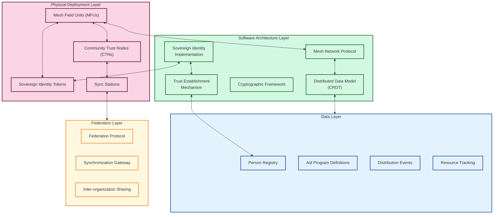

### A.2 Trust Circle Establishment

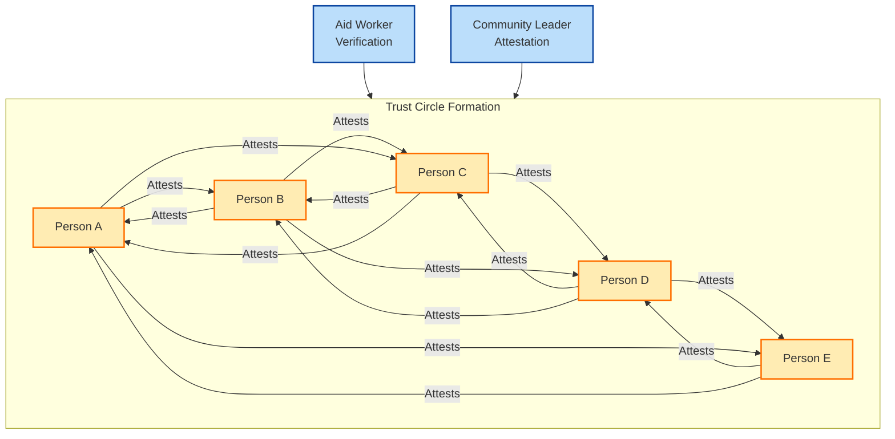

### A.3 Data Synchronization Flow

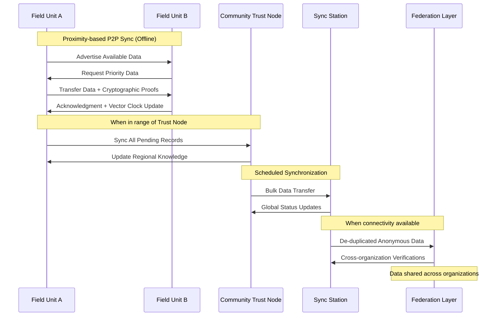

### A.4 Data Model

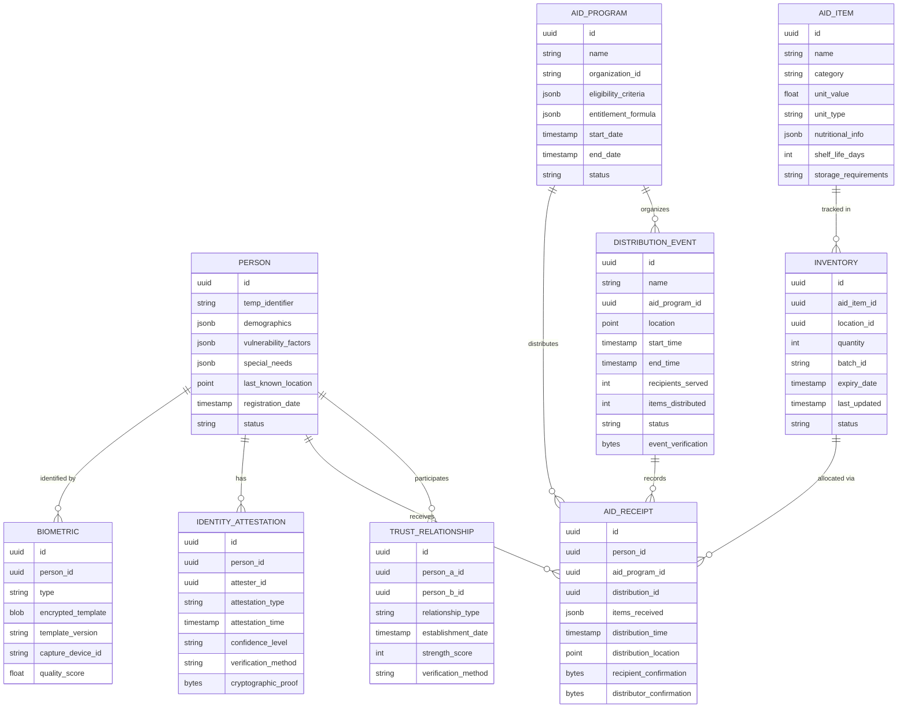

### A.5 System Security Architecture

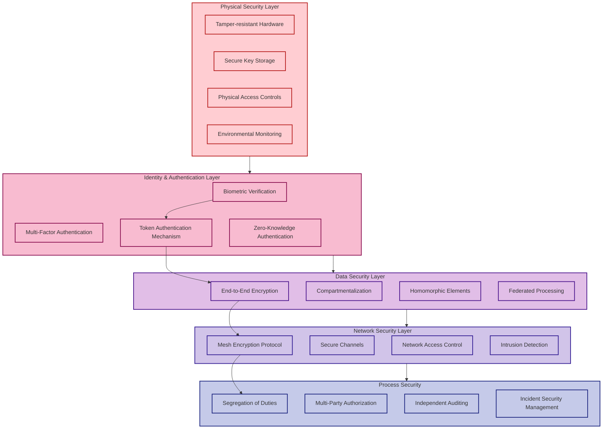

### A.6 Registration and Distribution Workflow

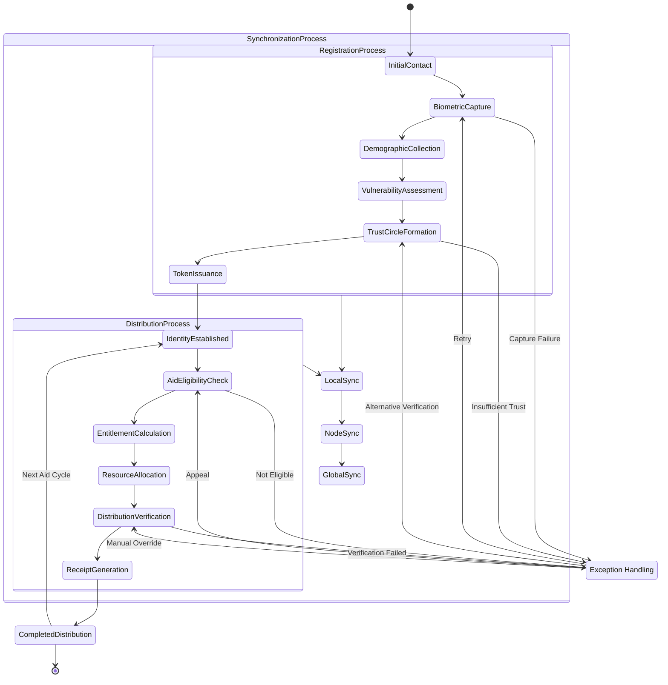

---

## Appendix B: Example Workflows

### B.1 Initial Registration Process

1. Aid worker meets with recipient
2. Worker captures basic data and biometrics
3. System generates unique identifier
4. Worker associates recipient with trust circle
5. System issues sovereign identity token
6. Recipient receives token and usage explanation
7. Record stored on field unit with cryptographic sealing
8. Data queued for synchronization 

### B.2 Aid Distribution Process

1. Recipient presents at distribution point
2. Sovereign identity verified via token + biometric
3. System confirms eligibility and entitlement
4. Aid worker records aid package details
5. Recipient confirms receipt (biometric or signature)
6. System creates tamper-proof distribution record
7. Receipt issued to recipient
8. Inventory updated

### B.3 Cross-Organization Verification

1. Recipient seeks aid from second organization
2. Presents sovereign identity token
3. Local field unit verifies identity
4. System checks for previous aid (privacy-preserving query)
5. If found, confirms non-duplication eligibility
6. If eligible, proceeds with distribution
7. Links records without exposing details to either organization
8. Synchronizes anonymized distribution data

---

## Appendix C: Security and Privacy Analysis

### C.1 Threat Model

1. **Adversary Types**
   - External attackers seeking to defraud aid system
   - Insiders attempting to divert resources
   - Coercive actors forcing recipients to surrender aid
   - Nation-state actors conducting surveillance

2. **Asset Analysis**
   - Personal identifying information
   - Biometric templates
   - Distribution records
   - Aid resource inventories
   - System integrity and availability

3. **Attack Surface**
   - Field unit physical security
   - Local wireless mesh communications
   - Synchronization operations
   - Human operators and processes

### C.2 Countermeasures

1. **Technical Countermeasures**
   - End-to-end encryption
   - Multi-factor authentication
   - Tamper-evident logs
   - Anomaly detection

2. **Procedural Countermeasures**
   - Segregation of duties
   - Multi-party authorization
   - Regular security audits
   - Incident response procedures

3. **Physical Countermeasures**
   - Tamper-resistant hardware
   - Secure key storage
   - Physical access controls
   - Environmental monitoring

### C.3 Privacy Analysis

1. **Data Minimization**
   - Collection limitation
   - Purpose limitation
   - Storage limitation
   - Processing limitation

2. **Privacy Controls**
   - Compartmentalization of data
   - Selective disclosure mechanisms
   - Consent management
   - Right to be forgotten implementation

3. **Privacy Risk Mitigations**
   - Differential privacy techniques
   - Federated processing
   - Local computation preference
   - Anonymization patterns 

---

## Appendix D: Deployment Architecture and Infrastructure

### D.1 Physical Deployment Model

MESA's deployment architecture is designed to function in challenging humanitarian contexts with varying levels of infrastructure, from urban refugee camps with intermittent electricity to remote rural areas with no connectivity.

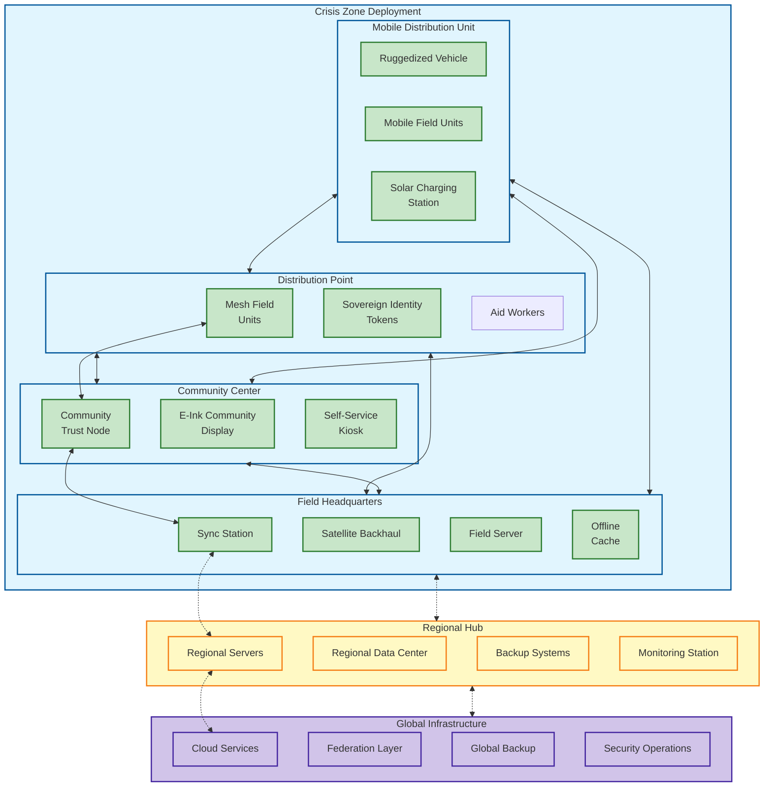

### D.2 Infrastructure Requirements

#### D.2.1 Crisis Zone Infrastructure

| Component | Specifications | Quantity per 10,000 Recipients | Power Requirements |
|-----------|----------------|--------------------------------|-------------------|
| Mesh Field Units | Ruggedized tablets, 10" screen, 512GB storage, 12hr battery | 20-30 | Solar charger 15W |
| Community Trust Nodes | Hardened computer, 1TB storage, mesh networking | 3-5 | Solar panel 100W + battery backup |
| Sovereign Identity Tokens | NFC-enabled cards with secure element | 10,000+ | N/A (passive) |
| Sync Stations | Server-grade computer, 20TB storage | 1-2 | Solar/generator hybrid 500W |
| Mobile Distribution Units | 4x4 vehicle with integrated technology | 1-3 | Vehicle alternator + solar panels |

#### D.2.2 Regional Infrastructure

Regional infrastructure serves multiple crisis zones within a geographic area, providing backup, aggregation, and intermittent connectivity:

- **Regional Data Centers**: Containerized micro-datacenters with redundant power
- **Connectivity Hubs**: VSAT terminals with store-and-forward capabilities
- **Security Operations**: Physical and digital security monitoring
- **Maintenance Facilities**: Technology repair and replacement logistics

#### D.2.3 Global Infrastructure

- **Cloud Services**: Multi-region cloud deployment with data sovereignty controls
- **Federation Services**: Decentralized identity anchoring and cross-organization protocols
- **Backup Archive**: Air-gapped deep storage for disaster recovery
- **Security Operations Center**: 24/7 monitoring for security incidents

### D.3 Network Architecture

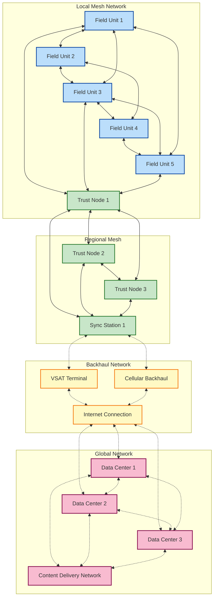

## Appendix E: Technical Stack and Implementation

### E.1 Technology Stack Overview

MESA employs a carefully selected technology stack optimized for offline operation, security, and resilience in challenging environments:

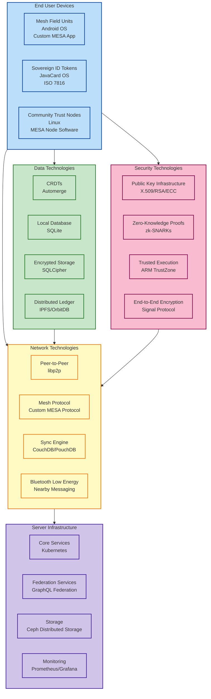

### E.2 Technology Selection Rationale

#### E.2.1 Field-Level Technologies

| Component | Technology Choice | Rationale |
|-----------|-------------------|-----------|
| Field Unit OS | Android AOSP | Open-source, customizable, wide hardware support, robust security model |
| Local Database | SQLite/SQLCipher | Embedded, encrypted, reliable, low resource consumption |
| Data Synchronization | CRDTs (Automerge) | Conflict-free merging without central coordination |
| Mesh Networking | Custom protocol over BLE/WiFi Direct | Optimized for humanitarian contexts, low power, resilient |
| Biometric Capture | Open-source biometric libraries | Vendor-independent, adaptable to different hardware |
| Cryptography | Libsodium | Well-audited, side-channel resistant, works on constrained devices |

#### E.2.2 Server-Side Technologies

| Component | Technology Choice | Rationale |
|-----------|-------------------|-----------|
| Core Services | Kubernetes | Container orchestration, self-healing, flexible deployment |
| Federation Services | GraphQL | Schema-based integration, flexible queries with minimal data transfer |
| Storage | Ceph | Distributed storage with self-healing capabilities |
| Secure Processing | Confidential Computing | Data processing with hardware-level isolation |
| Identity Management | Self-Sovereign Identity Standards | Decentralized identity management compatible with W3C DID standards |
| API Gateway | Envoy/Kong | Advanced traffic management, security features |

#### E.2.3 Development and Deployment Tools

| Purpose | Technology | Rationale |
|---------|------------|-----------|
| CI/CD | GitLab CI | Comprehensive pipeline management, self-hostable |
| Monitoring | Prometheus/Grafana | Industry standard observability stack |
| Security Testing | OWASP ZAP, Dependency Track | Comprehensive vulnerability management |
| Field Testing | Custom simulation environment | Replicates challenging network and infrastructure conditions |

### E.3 Software Architecture

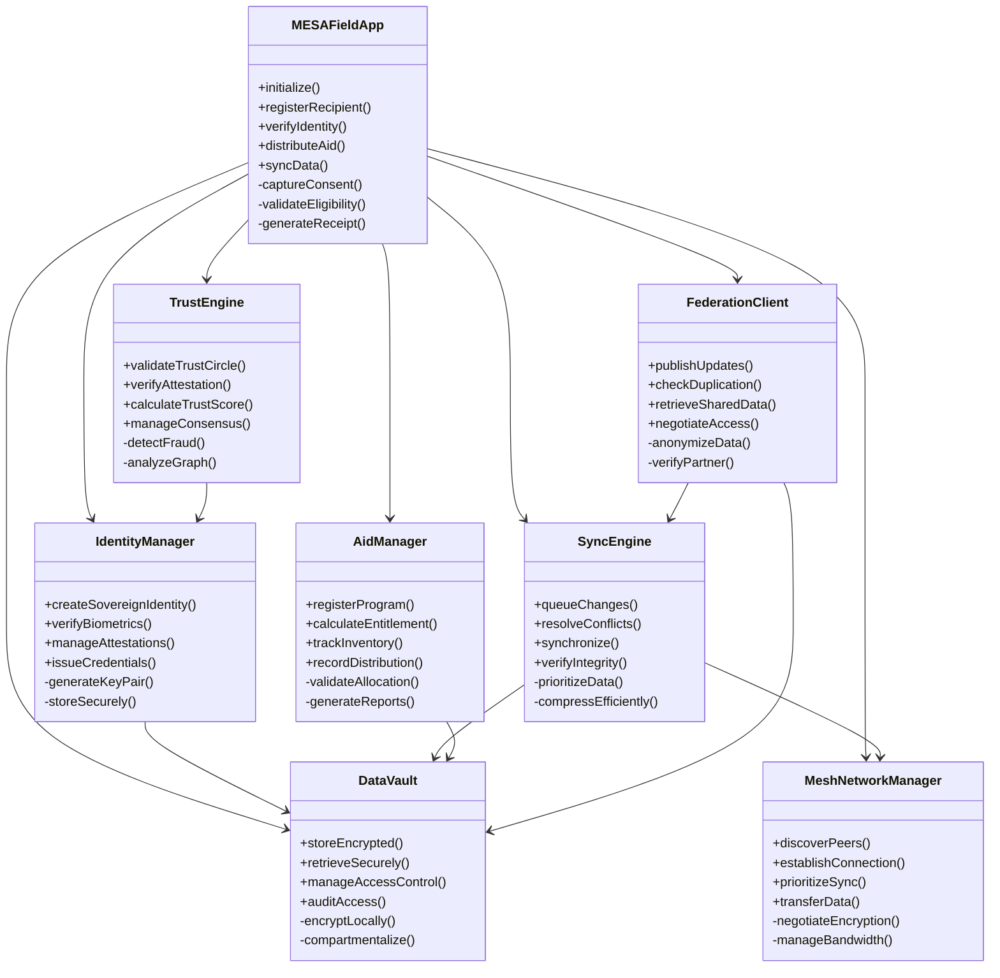

## Appendix F: Federation Layer Architecture

The Federation Layer enables cross-organizational coordination without requiring central authority or continuous connectivity. This layer is essential for preventing aid duplication, enabling recipient mobility between different aid providers, and supporting coordinated responses.

### F.1 Federation Protocol Architecture

```mermaid
flowchart TD
    subgraph OrgA["Organization A"]
        FPA["Federation Protocol<br>Endpoint"]
        IDPA["Identity Provider A"]
        AidDBA["Aid Distribution<br>Database A"]
    end
    
    subgraph OrgB["Organization B"]
        FPB["Federation Protocol<br>Endpoint"]
        IDPB["Identity Provider B"]
        AidDBB["Aid Distribution<br>Database B"]
    end
    
    subgraph OrgC["Organization C"]
        FPC["Federation Protocol<br>Endpoint"]
        IDPC["Identity Provider C"]
        AidDBC["Aid Distribution<br>Database C"]
    end
    
    subgraph FederationLayer["Federation Services"]
        IDRegistry["Decentralized<br>Identity Registry"]
        AidRegistry["Aid Distribution<br>Registry"]
        ConsentManager["Consent<br>Management"]
        ZKQueries["Zero-Knowledge<br>Queries"]
        Governance["Governance<br>Framework"]
    end
    
    %% Connections
    FPA <--> FederationLayer
    FPB <--> FederationLayer
    FPC <--> FederationLayer
    
    IDPA <--> FPA
    IDPB <--> FPB
    IDPC <--> FPC
    
    AidDBA <--> FPA
    AidDBB <--> FPB
    AidDBC <--> FPC
    
    %% Specific connections
    IDPA -.-> IDRegistry
    IDPB -.-> IDRegistry
    IDPC -.-> IDRegistry
    
    AidDBA -.-> AidRegistry
    AidDBB -.-> AidRegistry
    AidDBC -.-> AidRegistry
    
    ConsentManager --> ZKQueries
    ZKQueries --> AidRegistry
    Governance --> IDRegistry
    Governance --> AidRegistry
    
    %% Styling
    classDef orgA fill:#bbdefb,stroke:#0d47a1,stroke-width:2px
    classDef orgB fill:#c8e6c9,stroke:#2e7d32,stroke-width:2px
    classDef orgC fill:#fff9c4,stroke:#f57f17,stroke-width:2px
    classDef federation fill:#f8bbd0,stroke:#880e4f,stroke-width:2px
    
    class OrgA,FPA,IDPA,AidDBA orgA
    class OrgB,FPB,IDPB,AidDBB orgB
    class OrgC,FPC,IDPC,AidDBC orgC
    class FederationLayer,IDRegistry,AidRegistry,ConsentManager,ZKQueries,Governance federation
```

### F.2 Federation Layer Components

#### F.2.1 Decentralized Identity Registry

The Decentralized Identity Registry enables cross-organization validation of identities without exposing personally identifiable information:

- **Core Technology**: Blockchain/DLT-based identity anchoring (Hyperledger Indy/Sovrin)
- **Key Features**:
  - Cryptographic linking of separate organization identifiers
  - Revocation registries for compromised credentials
  - Multi-signature trust endorsement
  - Auditable governance framework

#### F.2.2 Aid Distribution Registry

The Aid Distribution Registry prevents double-dipping across organizations while preserving privacy:

- **Core Technology**: Zero-knowledge proofs over federated data
- **Key Features**:
  - Privacy-preserving aid receipt verification
  - Demographic analysis without individual identification
  - Temporal checks with minimal information disclosure
  - Secure multi-party computation for cross-organization statistics

#### F.2.3 Consent Management

The Consent Management system ensures recipients maintain control over their data:

- **Core Technology**: Verifiable Claims and Delegated Authorization
- **Key Features**:
  - Recipient-controlled data sharing policies
  - Revocable consent tracking
  - Purpose-based access limits
  - Delegation mechanisms for vulnerable populations

### F.3 Federation Protocol

The MESA Federation Protocol defines the interaction patterns between participating organizations:

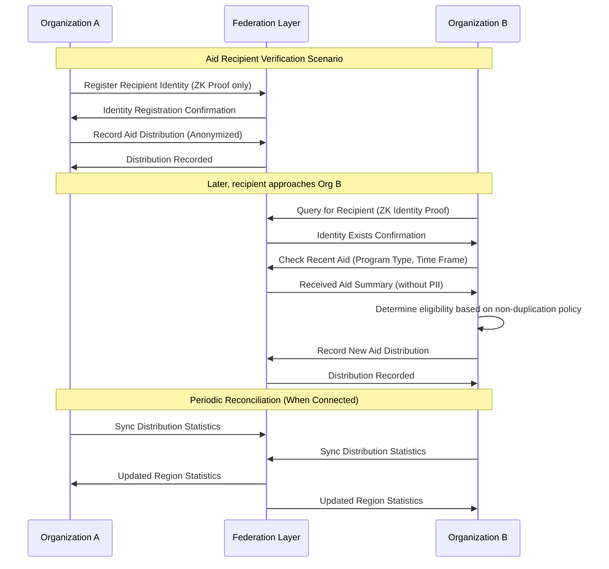

### F.4 Distributed Governance Framework

The Federation Layer's operation is governed by a distributed governance framework:

- **Technical Governance**: Standards and protocols for interoperability
- **Operational Governance**: Rules for joining the federation, data retention policies
- **Ethical Governance**: Privacy requirements, security standards, audit procedures
- **Multi-stakeholder Model**: Equal representation from NGOs, technical experts, and recipient advocates

## Appendix G: Performance and Scalability Architecture

MESA's architecture is designed to scale from small-scale deployments of a few hundred recipients to major humanitarian crises with millions of affected people, while maintaining performance under challenging conditions.

### G.1 Performance Metrics and Targets

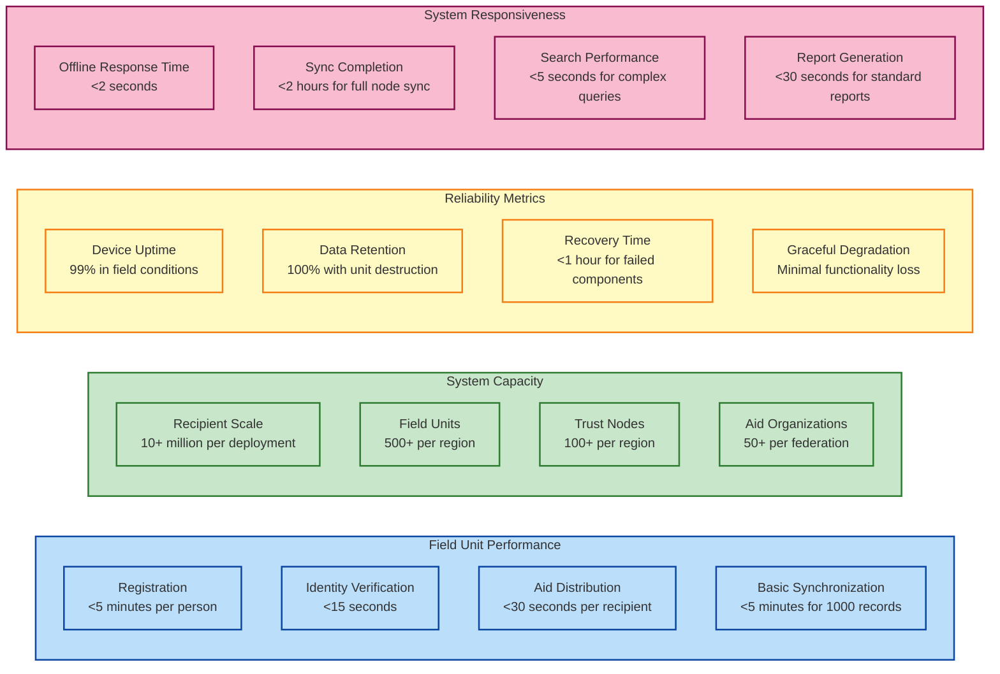

### G.2 Scalability Mechanisms

#### G.2.1 Horizontal Scaling Architecture

MESA's architecture enables multiple dimensions of scaling to accommodate growing crisis response needs:

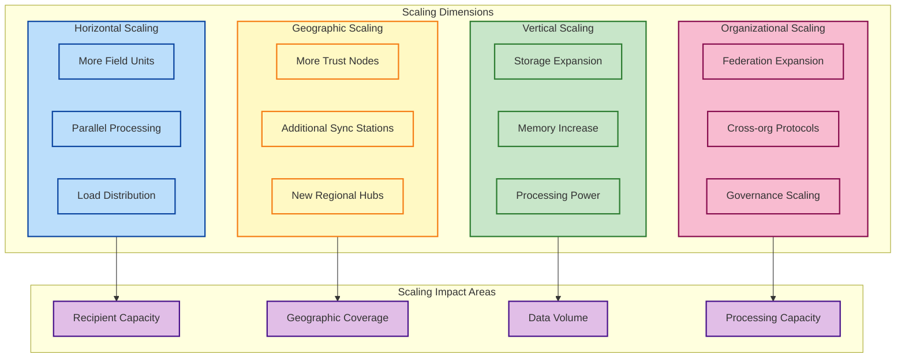

#### G.2.2 Data Flow Optimization

The system employs multiple strategies to optimize data flow in bandwidth-constrained environments:

| Strategy | Implementation | Benefit |
|----------|----------------|---------|
| Prioritized Synchronization | Critical data synced first | Essential functions work with minimal connectivity |
| Differential Synchronization | Only changes transmitted | 90% bandwidth reduction vs. full sync |
| Data Compression | Context-aware compression | 70-85% size reduction for typical datasets |
| Deduplication | Content-based deduplication | Eliminates redundant data transfer |
| Scheduled Synchronization | Off-peak data transfer | Utilizes available bandwidth efficiently |

#### G.2.3 Database Sharding Strategy

The data architecture utilizes natural sharding along geographic and organizational boundaries:

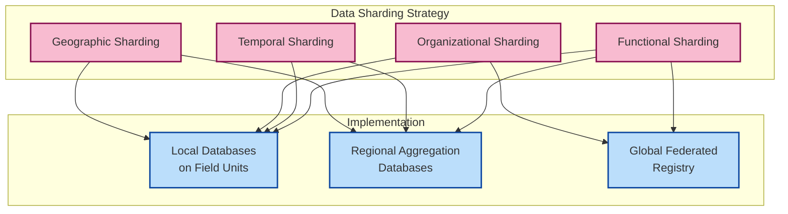

### G.3 Performance Optimization Techniques

#### G.3.1 Offline-First Design Patterns

MESA employs specific design patterns to ensure optimal performance in offline scenarios:

1. **Local-First Processing**: All critical operations complete locally before synchronization
2. **Progressive Enhancement**: Core functionality works offline with additional features when connected
3. **Optimistic UI**: Immediate user feedback with background synchronization
4. **Queue-Based Operations**: Operations queued and executed when resources available
5. **Predictive Prefetching**: Anticipatory data loading based on likely needs

#### G.3.2 Resource Utilization Optimization

Field operations in humanitarian contexts require careful resource management:

| Resource | Optimization Technique | Impact |
|----------|------------------------|--------|
| Battery Power | Adaptive duty cycling | 40-60% power saving |
| Storage | Tiered storage architecture | Prioritized use of limited space |
| CPU | Workload scheduling | Processing during idle periods |
| Memory | Compressed in-memory data structures | 3x more data in same memory |
| Network | Adaptive protocol selection | Optimal use of available bandwidth |

### G.4 Scalability Testing Framework

MESA's scalability is validated through a comprehensive testing framework:

1. **Load Testing**: Simulated registration/distribution for 100,000+ recipients
2. **Stress Testing**: System behavior under extreme conditions (10x normal load)
3. **Soak Testing**: Continuous operation for 30+ days in simulated field conditions
4. **Disaster Recovery Testing**: Data recovery after catastrophic failure
5. **Geographic Scale Testing**: Multi-region, multi-organization simulation

---

## Appendix H: Implementation and Scale-up Roadmap

The implementation of MESA follows a phased approach that allows for real-world validation, refinement, and organic growth of the system.

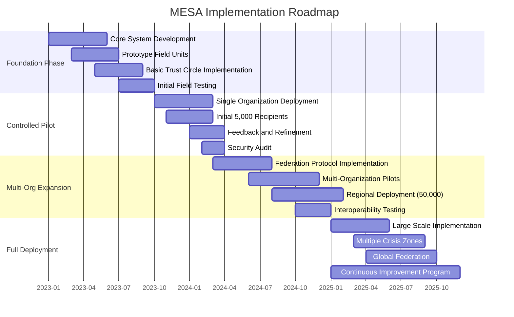