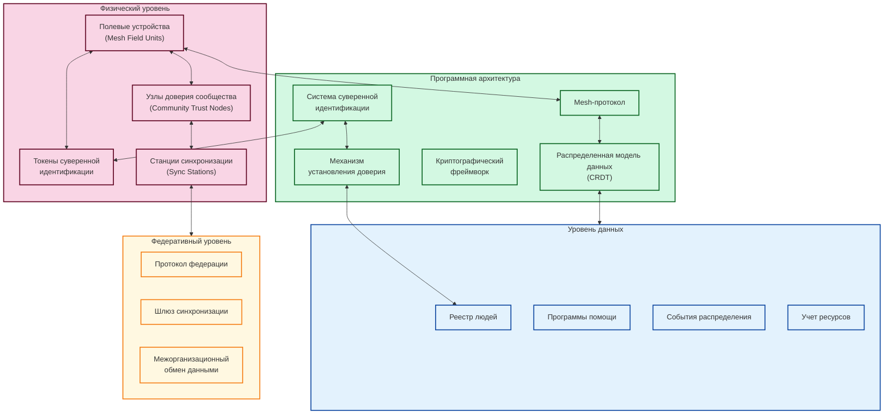
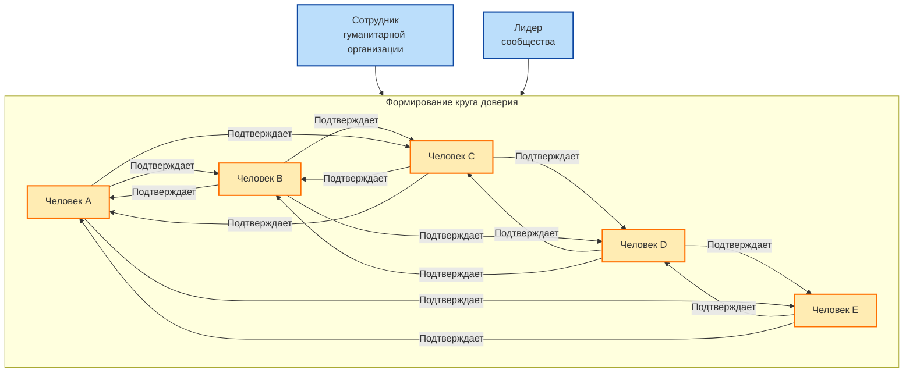
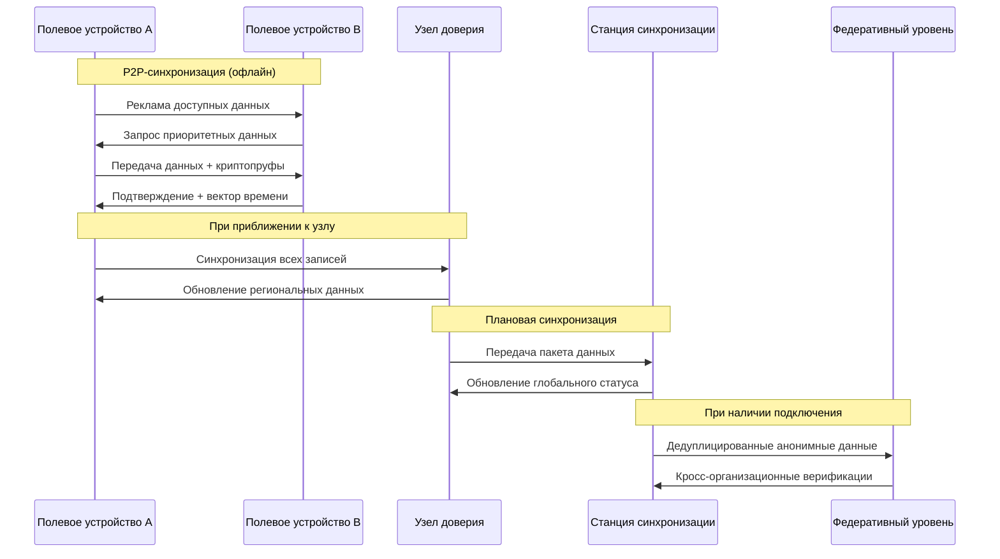
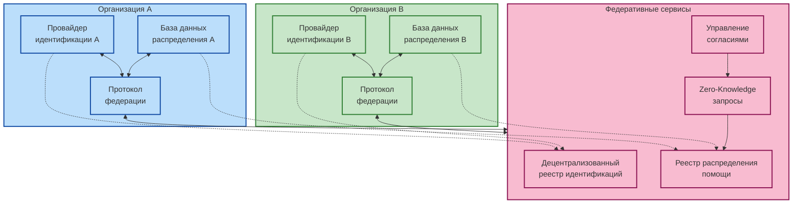

# MESA: Mesh-Enabled Sovereign Aid System
## Децентрализованная система распределения гуманитарной помощи

## 1. Обзор системы

MESA представляет собой инновационную систему для распределения гуманитарной помощи в кризисных регионах, решающую ключевые проблемы:

- Работа без подключения к интернету
- Предотвращение дублирования и мошенничества
- Сохранение контроля получателей над своими данными
- Обеспечение прозрачности без централизованного контроля
- Кросс-организационная совместимость

В основе MESA лежит биомиметический подход, вдохновленный мицелиальными сетями грибов - устойчивыми распределенными структурами без централизованного управления.

## 2. Ключевые принципы и компоненты

### 2.1 Ключевые принципы

- **Суверенная идентификация**: Получатели владеют и контролируют свои данные
- **Mesh-first дизайн**: Автономная работа без постоянного подключения
- **Круги доверия**: Децентрализованная верификация через социальные связи
- **Асинхронный консенсус**: Согласованность данных без постоянного соединения
- **Прогрессивное улучшение**: Расширение функциональности при улучшении инфраструктуры

### 2.2 Архитектура системы

## 3. Функциональные возможности

### 3.1 Идентификация и верификация
- Мультимодальная биометрическая идентификация
- Система "кругов доверия" для подтверждения личности
- Криптографически защищенные токены идентификации

### 3.2 Распределение помощи
- Офлайн-верификация личности и прав
- Мульти-подписи для подтверждения доставки
- Криптографическое подтверждение получения
- Управление инвентаризацией в полевых условиях

### 3.3 Контроль данных и прозрачность
- Управление согласием на использование данных
- Селективное раскрытие информации
- Неизменяемый журнал транзакций
- Аналитика, сохраняющая приватность

## 4. Техническая реализация

### 4.1 Формирование доверия

### 4.2 Архитектура синхронизации

### 4.3 Технологический стек

- **Устройства**: Android OS, JavaCard, Linux
- **Данные**: CRDT (Automerge), SQLite/SQLCipher, IPFS/OrbitDB
- **Сеть**: libp2p, Mesh-протокол, CouchDB/PouchDB, Bluetooth LE
- **Безопасность**: PKI (X.509/RSA/ECC), Zero-Knowledge Proofs, ARM TrustZone, Signal Protocol

## 5. Федеративная архитектура

Федеративный уровень обеспечивает межорганизационную координацию:

## 6. Ключевые характеристики и требования

### 6.1 Производительность и масштабируемость
- Регистрация нового получателя < 5 минут
- Верификация идентичности < 15 секунд
- Поддержка 10+ миллионов получателей
- До 500 полевых устройств на регион

### 6.2 Надежность и безопасность
- Работа при температуре от -10°C до 45°C
- Защита от атак подмены личности
- Предотвращение подделки данных
- Защита от внутренних угроз

### 6.3 Удобство использования
- Поддержка для населения с низким уровнем грамотности
- Многоязычный интерфейс
- Приспособления для людей с ограниченными возможностями

## 7. Стратегия внедрения

- **Фаза 1**: Разработка ядра и прототипы (6 месяцев)
- **Фаза 2**: Контролируемый пилот с одной организацией (6 месяцев)
- **Фаза 3**: Расширение и мульти-организационные пилоты (9 месяцев)
- **Фаза 4**: Полномасштабное развертывание (12 месяцев)

## 8. Механизмы обеспечения доверия

- **Круги доверия**: Группы из 3-5 человек, перекрестно подтверждающих личности
- **Многосторонняя верификация**: Сотрудники, лидеры сообщества, получатели
- **Криптографические якоря**: Распределенные реестры, пороговая криптография
- **Усиление доверия со временем**: Последовательная идентификация и интеграция

## 9. Заключение

MESA переосмысливает системы распределения гуманитарной помощи, основываясь на принципах децентрализованных сетей. Приоритет отдается доверию, автономной работе и суверенитету данных получателей, создавая систему, которая:

1. Функционирует в сложных условиях с ограниченной инфраструктурой
2. Масштабируется по мере эволюции потребностей
3. Сохраняет достоинство и агентность получателей помощи
4. Строит доверие между организациями и сообществами
5. Обеспечивает прозрачность без компромиссов в отношении приватности