# MESA: Mycelial-Encoded Sovereign Aid Network
## A Resilient Biomimetic Humanitarian Distribution System

## 1. Summary

MESA represents a paradigm shift in humanitarian aid delivery through biomimetic design principles that mimic mycelial networks found in nature. This novel approach addresses the critical challenges that plague current humanitarian distribution systems:

- **Infrastructure Independence**: Operating seamlessly in regions with no connectivity
- **Duplicity Prevention**: Eliminating systemic fraud through decentralized verification
- **Data Sovereignty**: Ensuring recipients maintain complete ownership of their personal data
- **Transparent Distribution**: Creating accountability without centralized oversight
- **Cross-Organizational Harmony**: Enabling multiple aid organizations to coordinate efficiently without trust dependencies

At its core, MESA draws inspiration from fungal mycelium networks—nature's most resilient distributed systems—which transfer nutrients, share information, and maintain ecosystem balance without centralized coordination. This biomimetic foundation enables MESA to create an organic, self-healing network that adapts to local conditions and supports human dignity through technological sovereignty.

## 2. Foundational Architecture

### 2.1 Guiding Principles

MESA operates on five fundamental principles that diverge from conventional humanitarian information systems:

- **Sovereign Identity Framework**: Recipients own cryptographic keys controlling their identity data
- **Mesh-First Architecture**: Designed for disconnected operation with connectivity as an enhancement
- **Trust Circles Protocol**: Community-based identity verification replacing institutional authority
- **Asynchronous Consensus Mechanism**: Eventual consistency across distributed nodes without connectivity dependence
- **Progressive Complexity Adaptation**: System capabilities that evolve based on available infrastructure

### 2.2 Biomimetic System Architecture

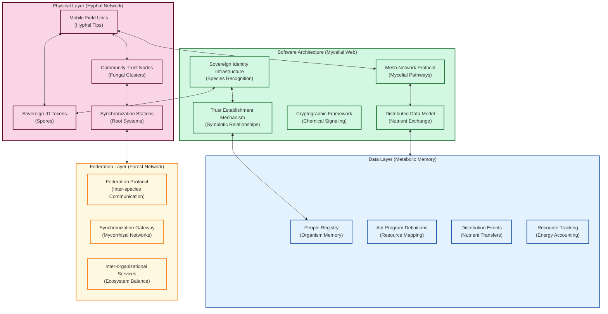

The architecture mirrors natural mycelial networks, where:
- The Physical Layer represents the visible tendrils (hyphae) that interact with the environment
- The Software Layer functions as the hidden mycelial web that processes and distributes information
- The Data Layer acts as the metabolic memory system preserving the network's knowledge
- The Federation Layer enables diverse fungal colonies to interact and form symbiotic relationships

## 3. Functional Capabilities

### 3.1 Sovereign Identity Ecosystem

The identity system in MESA represents a fundamental shift from institutional to community-based trust:

- **Multimodal Biometric Fusion**: Combines facial recognition, fingerprints, and iris scans with anti-spoofing technology that works offline
- **Community Authentication Networks**: Implements "trust circles" where 3-5 community members cross-verify identities
- **Zero-Knowledge Credentials**: Allows proving eligibility without revealing underlying personal data
- **Self-Sovereign Identity Tokens**: Tamper-evident physical devices storing cryptographic proofs accessible only to their owners

### 3.2 Resilient Aid Distribution

Distribution processes are designed to function in austere environments while maintaining integrity:

- **Offline Verification Protocol**: Validates identity and entitlements without network connectivity
- **Multi-Party Attestation**: Requires signatures from recipient, aid worker, and community witness
- **Supply Chain Traceability**: Tracks aid items from procurement to final delivery
- **Field Inventory Reconciliation**: Automatically balances distributed vs. remaining resources

### 3.3 Recipient-Controlled Data Flow

Data sovereignty is enforced through architectural design:

- **Granular Consent Management**: Recipients specify exactly what data is shared, with whom, and for how long
- **Selective Disclosure Proofs**: Enables verification of eligibility without exposing underlying data
- **Compartmentalized Storage**: Keeps sensitive data physically separated across the network
- **Temporal Access Control**: Automatically revokes access permissions after preset time periods
- **Privacy-Preserving Analytics**: Generates insights without exposing individual data through homomorphic encryption

## 4. Technical Implementation

### 4.1 Trust Circle Formation

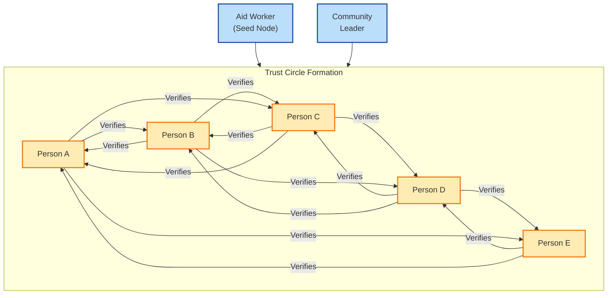

Trust circles follow a specific formation protocol:
1. Aid worker creates initial seed verification
2. Community leaders validate first-degree connections
3. Trust propagates through existing relationships
4. Cross-verifications strengthen the network
5. Trust scores are calculated based on network topology
6. Threshold verification requirements prevent collusion
7. Trust circle expansion follows organic community connections

### 4.2 Data Model and Storage Architecture

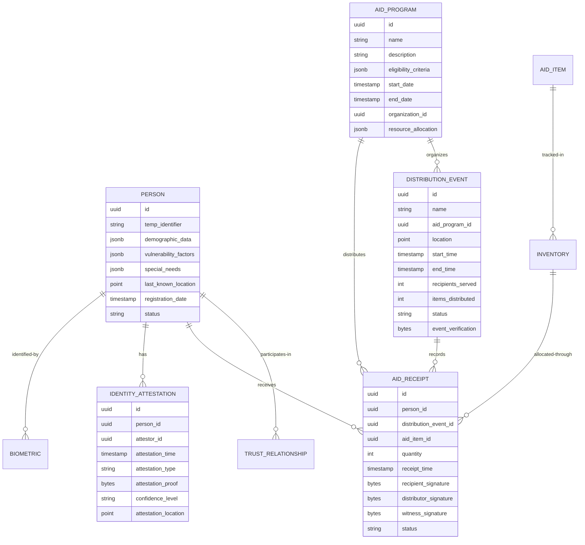

The data model follows a conflict-free replicated data type (CRDT) structure that enables:
- Asynchronous updates without coordination
- Automatic conflict resolution
- Eventual consistency across disconnected nodes
- Logical timestamps for causal ordering
- Sharded storage based on geographic boundaries

### 4.3 Mycelial Synchronization Protocol

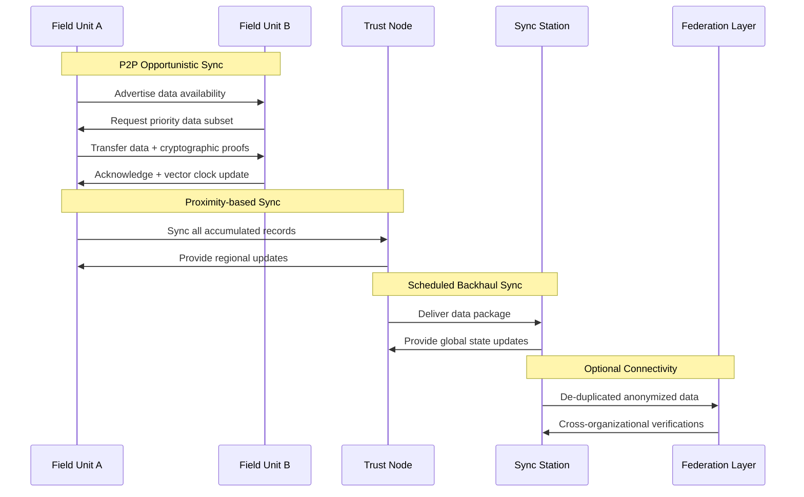

The synchronization protocol is designed to emulate mycelial nutrient exchange:
1. Opportunistic exchange between nearby units
2. Prioritization of critical data (aid receipts, identity proofs)
3. Cryptographic validation of data integrity
4. Vector clock synchronization across devices
5. Gravitational data flow toward permanent storage
6. Selective replication based on geographic relevance
7. Backpressure mechanisms preventing data flooding

### 4.4 Technology Stack: Rhizomatic Integration

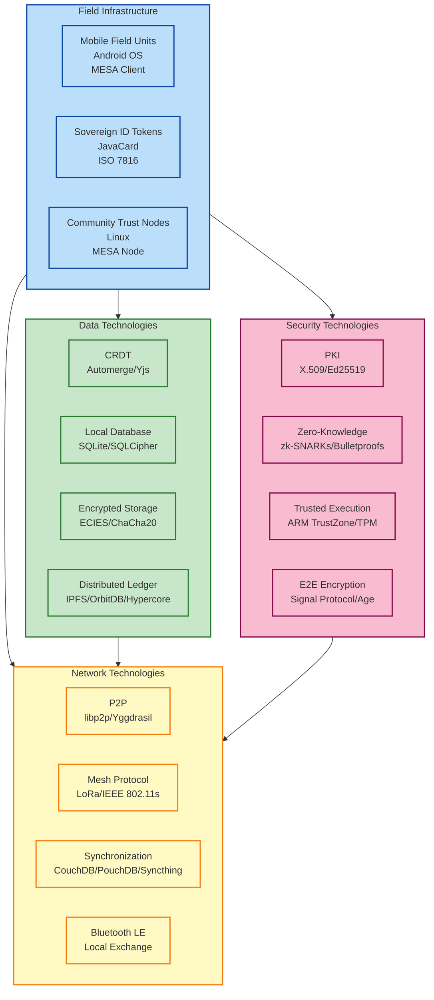

## 5. Federation Architecture: The Mycelial Forest

The federation layer enables diverse aid organizations to coordinate like different fungal species in a forest ecosystem:

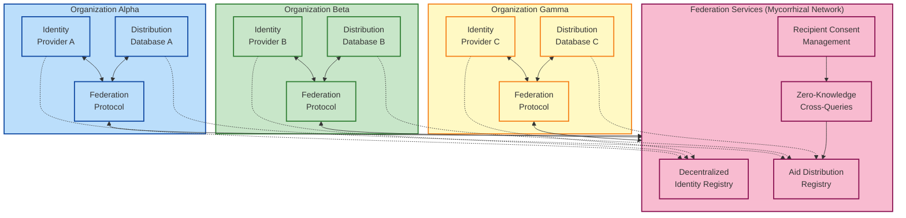

Federation functions using a decentralized protocol that:
1. Maintains organizational sovereignty over internal operations
2. Enables cross-organizational deduplication while preserving privacy
3. Creates decentralized consensus on global aid distribution
4. Manages consent across organizational boundaries
5. Implements zero-knowledge proofs for cross-organizational queries
6. Enforces cryptographic verification of federation members
7. Provides dispute resolution mechanisms

## 6. Non-Functional Requirements: Ecosystem Resilience

### 6.1 Performance & Scalability (Growth Dynamics)

MESA's performance parameters mirror biological growth patterns:

| Metric | Requirement | Biological Parallel |
|--------|-------------|---------------------|
| Registration time | < 5 minutes per recipient | Cell division rate |
| Identity verification | < 15 seconds | Immune system recognition |
| Aid distribution | < 30 seconds per recipient | Nutrient absorption rate |
| Distribution capacity | 2,000+ recipients per day per point | Fruit body nutrient delivery |
| System scale | 10+ million recipients per deployment | Forest-scale mycelium |
| Field device density | Up to 500 field units per region | Hyphal tip density |
| Trust node density | Up to 100 trust nodes per region | Fungal cluster density |
| Organization support | 50+ humanitarian organizations | Species diversity |

### 6.2 Environmental Resilience

Like its fungal inspiration, MESA thrives in harsh environments:

- **Physical Durability**: Operating temperature -10°C to 45°C
- **Environmental Protection**: IP65 dust and water resistance
- **Power Resilience**: 10+ hours battery operation, solar recharging
- **Field Lifespan**: 3+ years in austere conditions
- **Thermal Management**: Passive cooling without fans
- **Impact Resistance**: 1.5m drop protection
- **Weight Constraints**: Portable units under 1kg

### 6.3 Security & Trust Mechanisms (Immunological Defense)

The security architecture mimics natural immune systems:

- **Identity Spoofing Prevention**: Multi-factor biometric liveness detection
- **Data Tampering Protection**: Cryptographic state verification
- **Denial of Service Resilience**: Local operation during attack conditions
- **Insider Threat Mitigation**: Threshold cryptography requiring multiple parties
- **Physical Security**: Tamper-evident hardware with secure elements
- **Anti-Collusion Mechanisms**: Trust graph analysis for unusual patterns
- **Side-Channel Protection**: Hardware-level countermeasures

### 6.4 Human-Centered Design

Interfaces are designed for universal accessibility:

- **Literacy-Independent Operation**: Visual and audio interfaces for non-literate users
- **Multilingual Support**: Top 10 languages per deployment region
- **Accessibility Features**: Accommodations for visual, hearing, motor impairments
- **Cultural Adaptability**: Customizable interfaces respecting local norms
- **Intuitive Navigation**: <3 steps for common tasks
- **Minimal Training**: <30 minutes for basic recipient proficiency
- **Error Recovery**: Clear paths to resolve common issues

## 7. Implementation Roadmap: Organic Growth Strategy

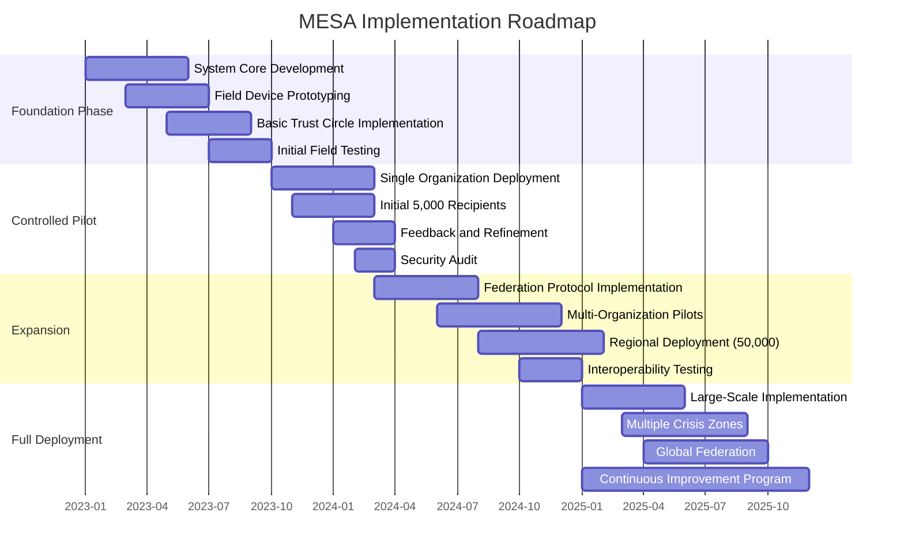

The implementation strategy follows organic growth patterns:
1. **Seeding Phase** (6 months): Core technology development
2. **Germination Phase** (6 months): Controlled pilot with one organization
3. **Growth Phase** (9 months): Multi-organizational expansion
4. **Propagation Phase** (12 months): Full-scale deployment across regions

## 8. Decentralized Trust: From Hierarchy to Mycelial Web

MESA replaces institutional trust with four biomimetic mechanisms:

### 8.1 Trust Circles (Mycorrhizal Connections)
- Groups of 3-5 individuals cross-verifying identities
- Web of interconnected attestations
- Multiple confirmations establishing identity
- Resistance to collusion through graph analysis
- Strengthening trust through repeated interactions

### 8.2 Multi-Party Verification (Symbiotic Relationships)
- Aid workers (registration and verification)
- Community leaders (membership confirmation)
- Aid recipients (trust circle verification)
- Humanitarian organizations (record validation)
- Local authorities (when appropriate)

### 8.3 Cryptographic Trust Anchors (Chemical Signaling)
- Distributed ledgers for immutable attestation history
- Threshold cryptography requiring multiple parties
- Zero-knowledge proofs for verification without disclosure
- Cross-organizational validation for consensus across systems
- Homomorphic encryption for privacy-preserving verification

### 8.4 Temporal Trust Strengthening (Mycelial Memory)
- Sequential identification builds confidence over time
- Distribution history consistency reinforces identity
- Community integration through expanding connections
- Cross-program validation through different initiatives
- Strengthening trust scores with each verified interaction

## 9. Key Innovations & Uniqueness Factors

MESA introduces several breakthrough capabilities not found in conventional humanitarian systems:

### 9.1 Mycelial Data Transport
Unlike traditional systems requiring constant connectivity, MESA's data moves opportunistically through the network like nutrients through mycelium, ensuring information eventually reaches its destination despite infrastructure challenges.

### 9.2 Sovereignty-Preserving Protocol
MESA's novel protocol ensures that no single entity—not even the implementing agencies—can access recipient data without explicit, verifiable consent, shifting the power dynamic in humanitarian aid.

### 9.3 Cryptobiological Verification
Inspired by how organisms recognize each other, MESA's verification uses a combination of physical characteristics, behavioral patterns, and social attestations to create unforgeable identities that function offline.

### 9.4 Ecosystem-Based Scalability
Rather than scaling through centralized infrastructure, MESA scales organically by adding nodes at the edges, allowing the system to grow proportionally with need without requiring central coordination.

### 9.5 Temporal Consensus Protocol
MESA's novel consensus mechanism doesn't require immediate agreement, instead allowing parts of the system to operate with eventual consistency, mirroring how biological systems maintain coherence despite delayed signal propagation.

## 10. Technical System Design: Detailed Architecture

### 10.1 Component Architecture: Modular Design

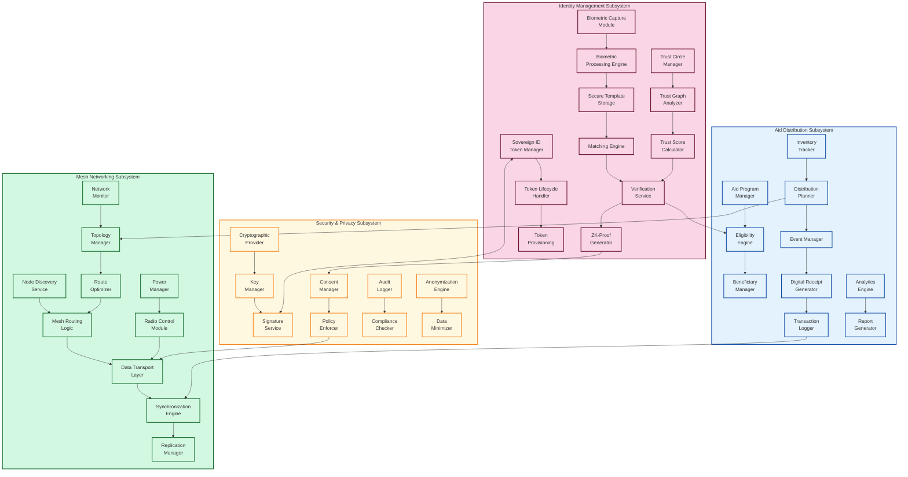

The component architecture follows a modular design approach where:

1. **Identity Management Subsystem**:
   - Biometric components handle capture, processing, and matching without storing raw biometrics
   - Trust components manage the social verification web and calculate trust scores
   - Token components manage the lifecycle of physical sovereign identity tokens

2. **Mesh Networking Subsystem**:
   - Network discovery and dynamic topology management for optimal resource utilization
   - Power-aware networking with adaptive radio controls for extended field operation
   - Synchronization engine implementing the CRDT-based replication protocol

3. **Aid Distribution Subsystem**:
   - Program and eligibility management for determining aid entitlements
   - Inventory and distribution planning with offline operation capabilities
   - Digital receipt generation with multi-signature verification

4. **Security & Privacy Subsystem**:
   - Cryptographic foundation with key management and signing services
   - Consent management enforcing recipient-defined data sharing policies
   - Anonymization engine for privacy-preserving analytics

### 10.2 Deployment Topology: Fieldable Infrastructure

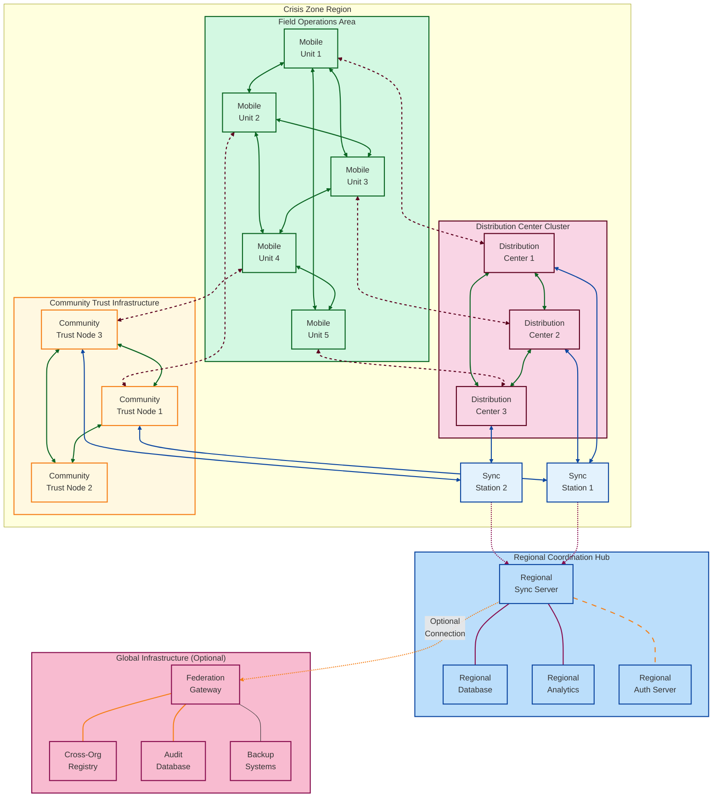

The deployment topology illustrates the physical infrastructure arrangement:

1. **Crisis Zone Infrastructure**:
   - Mobile Units form a dynamic mesh network, connecting opportunistically
   - Distribution Centers act as semi-permanent hubs with larger compute/storage
   - Community Trust Nodes provide localized verification anchors
   - Sync Stations serve as data aggregation points with periodic connectivity

2. **Regional Coordination Hub**:
   - Regional infrastructure deployed in nearby stable locations
   - Provides synchronization, analytics, and authentication services
   - Operates with intermittent connections to the crisis zone

3. **Global Infrastructure**:
   - Optional layer that enables cross-organizational coordination
   - Only activated when reliable connectivity is available
   - Provides federation services and secure backup facilities

The deployment is designed to be resilient with no single points of failure and operates effectively with intermittent or no connectivity to higher infrastructure tiers.

### 10.3 Security Architecture: Multi-Layered Protection

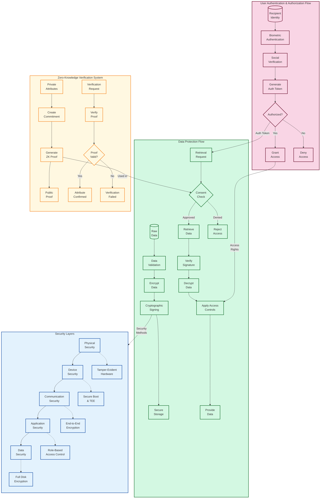

The security architecture implements defense-in-depth with multiple overlapping mechanisms:

1. **User Authentication & Authorization Flow**:
   - Combines biometric verification with social attestation
   - Generates time-limited authorization tokens
   - Makes contextual authorization decisions

2. **Data Protection Flow**:
   - Validates all data before processing
   - Implements end-to-end encryption with forward secrecy
   - Applies consent policies before data access
   - Uses cryptographic signatures to ensure data integrity

3. **Security Layers**:
   - Physical security with tamper-evident hardware
   - Device security using secure boot and trusted execution
   - Communication security with end-to-end encryption
   - Application security with role-based access control
   - Data security with full disk encryption

4. **Zero-Knowledge Verification System**:
   - Enables proving statements without revealing underlying data
   - Allows eligibility verification without exposing sensitive attributes
   - Provides cryptographic guarantees of data minimization

### 10.4 Fault Tolerance & Recovery Mechanisms

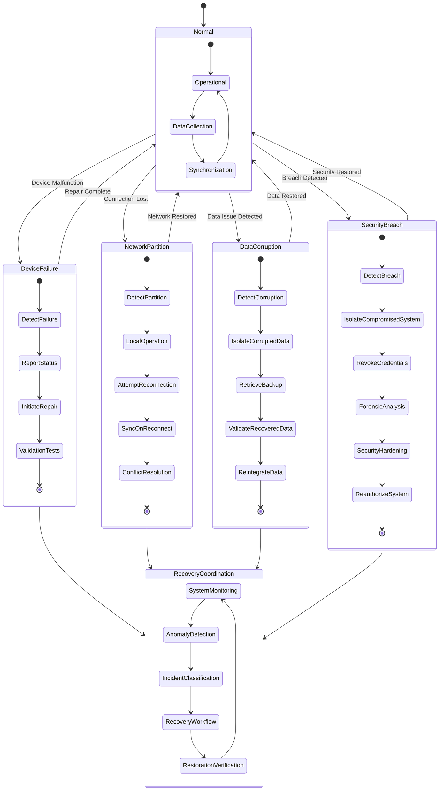

The fault tolerance architecture ensures system resilience across various failure scenarios:

1. **Device Failure Recovery**:
   - Automatic detection of malfunctioning components
   - Graceful degradation with continued operation
   - Hot-swappable field replaceable units
   - Self-diagnosis and repair protocols

2. **Network Partition Handling**:
   - Seamless transition to offline operation
   - Local data validation and operation continuity
   - Periodic reconnection attempts with exponential backoff
   - Conflict-free data merging on reconnection through CRDT

3. **Data Corruption Management**:
   - Checksums and cryptographic verification of all data
   - Corruption isolation to prevent spreading
   - Multi-tiered backup strategy with versioning
   - Data recovery with integrity validation

4. **Security Breach Responses**:
   - Anomaly detection for unusual access patterns
   - Automatic isolation of potentially compromised components
   - Key rotation and credential revocation capabilities
   - Secure recovery paths with forensic analysis

5. **Recovery Coordination**:
   - Centralized monitoring with distributed execution
   - Event classification and appropriate response selection
   - Systematized recovery workflows for each failure type
   - Verification of system integrity post-recovery

All recovery mechanisms operate without requiring internet connectivity and maintain local functionality during recovery processes.

## 11. Conclusion: Redefining Humanitarian Systems

MESA represents a fundamental reimagining of humanitarian aid distribution systems, recognizing that the most resilient systems in nature are not hierarchical but distributed and network-organized. By prioritizing trust relationships, autonomous operation, and recipient data sovereignty, MESA creates a system that:

1. Functions in the most challenging environments with limited infrastructure
2. Scales organically as needs evolve without requiring central coordination
3. Preserves the dignity and agency of aid recipients through technological sovereignty
4. Builds trust between aid organizations and communities through transparent processes
5. Enables accountability without compromising privacy through zero-knowledge verification

This approach transforms recipients from passive beneficiaries into active participants in the humanitarian ecosystem with sovereign identity and data rights, ensuring that technological systems enhance rather than diminish human dignity during humanitarian response.