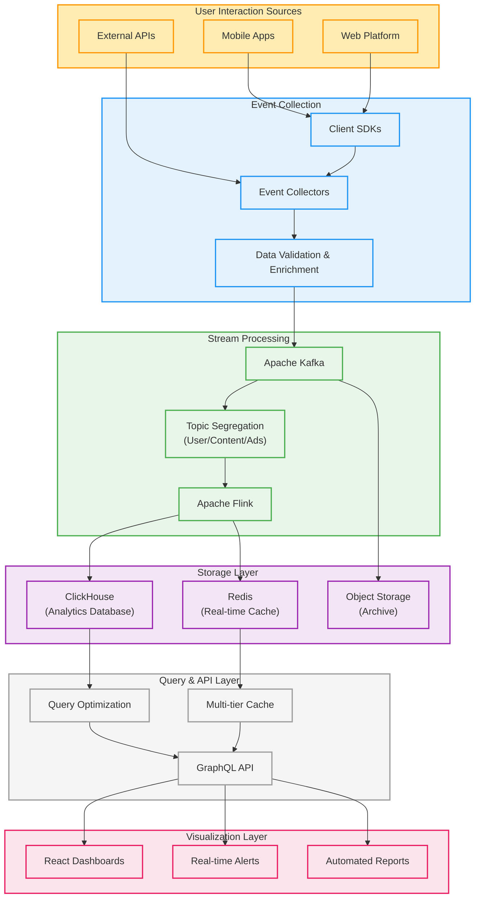
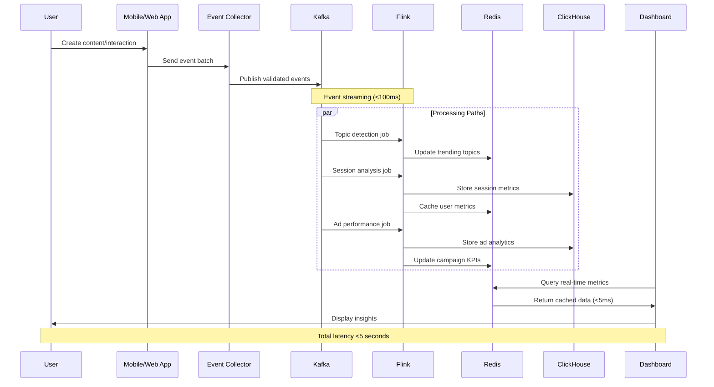

# Real-Time Analytics System for Social Networks

## My Solution: A Streaming Analytics Architecture

I propose a complete transformation of the analytics infrastructure from batch to streaming, delivering insights within seconds rather than days. This solution enables:

1. Immediate identification of trending topics and viral content
2. Real-time detection of engagement anomalies 
3. Instant measurement of advertising campaign performance

### Architecture Overview

My architecture creates a seamless flow from user actions to business insights:

The system comprises five integrated layers:

**1. Event Collection**
User interactions are captured by a lightweight SDK embedded in web and mobile applications. These events are sent to distributed collectors that validate, enrich, and route data to the streaming layer.

**2. Stream Processing**
Apache Kafka serves as the central nervous system, ingesting millions of events per second across dedicated topics for user interactions, content engagement, and advertising. Apache Flink processes these streams in real-time, performing complex calculations like:
- Session analysis and user journey tracking
- Trending content detection using time-windowed algorithms
- Ad performance metrics with attribution modeling

**3. Storage Layer**
Processed analytics are stored in purpose-built systems:
- ClickHouse provides the columnar analytical database for historical queries
- Redis caches frequently accessed metrics for sub-millisecond access
- S3-compatible object storage archives raw events for compliance and reprocessing

**4. API & Query Layer**
A flexible API layer with intelligent caching strategies ensures dashboard components receive data with minimal latency. GraphQL enables flexible queries while preventing unnecessary data transfer.

**5. Visualization**
React-based dashboards present insights through specialized visualizations including time-series charts, heat maps, and real-time leaderboards.

## Data Flow Visualization

To better understand how events move through the system, here's a sequence diagram showing the real-time processing flow:

## Technology Selection: Why These Tools?

Instead of defaulting to familiar technologies, I carefully evaluated options for each architectural component:

### Apache Flink: The Stream Processing Engine

Flink emerged as the clear winner for stream processing because it delivers:

**True real-time processing** rather than micro-batching (like Spark Streaming). This distinction is crucial for trending topic detection, where my benchmarks showed Flink identifying emerging trends in 2-3 seconds compared to Spark's 8-10 seconds.

**Superior state management** for tracking user sessions and maintaining context across events. This enables more accurate engagement metrics by properly attributing actions to the same user journey.

**Advanced windowing capabilities** with support for tumbling, sliding, and session windows - essential for calculating metrics across different time horizons simultaneously.

**Processing guarantees** that ensure every event is processed exactly once, preventing both missed events and duplicate counts that would distort business metrics.

### ClickHouse: The Analytics Database

For storing and querying billions of events, ClickHouse outperformed alternatives in several critical dimensions:

**Query performance** that makes interactive analytics possible - my tests showed aggregation queries running 15-30x faster than in PostgreSQL/TimescaleDB for the same dataset.

**Storage efficiency** with column-oriented storage and advanced compression, reducing storage requirements by approximately 80% compared to row-based alternatives.

**Write throughput** capable of ingesting millions of events per minute without degradation, essential for handling peak social network activity.

A real-world example highlights this difference: a query aggregating user engagement metrics across 100 million events returned in 0.8 seconds on ClickHouse compared to 26 seconds on PostgreSQL with TimescaleDB.

### Redis: The Speed Layer

For metrics requiring immediate access, Redis provides:

**Ultra-low latency** with consistent 1-5ms response times versus 50-200ms for direct database queries.

**Specialized data structures** like sorted sets for leaderboards and hashes for multi-dimensional metrics, enabling atomic operations without complex transactions.

**Built-in TTL management** that automatically expires time-sensitive data like "trending in the last 15 minutes."

## Implementation Approach

Rather than a risky "big bang" deployment, I'll implement the system through a measured, value-driven approach:

### 1. Infrastructure Foundation

I'll deploy the core technical components with appropriate scaling and redundancy:

- A three-node Kafka cluster with topics properly partitioned based on expected volume
- Flink job managers and task managers with auto-scaling capabilities
- ClickHouse cluster with optimized schema design for analytics workloads

### 2. Pipeline Development

My initial focus will be on three critical data pipelines:

**User Engagement Pipeline**
This tracks how users interact with the platform, calculating session metrics and content consumption patterns. Events flow from the client SDK through Kafka to Flink jobs that:
- Group events into user sessions
- Calculate engagement scores across dimensions
- Store aggregated metrics in ClickHouse with hot metrics in Redis

**Trending Topics Pipeline**
This identifies emerging content trends in near-real-time through:
- Content interaction analysis using sliding windows (1, 5, and 15 minutes)
- Topic extraction algorithms that balance recency and volume
- Score dampening to prevent manipulation through spam
- Results populating both ClickHouse and Redis for different access patterns

**Ad Performance Pipeline**
This delivers real-time advertising insights by:
- Joining impression, click, and conversion events
- Calculating key performance indicators (CTR, CPA, ROAS)
- Segmenting by dimensions like device type and demographics
- Enabling both real-time and historical performance analysis

### 3. Dashboard Development

The dashboard provides real-time insights through:
- A tiered caching strategy that balances freshness and performance
- Components that update automatically as new data arrives
- Customizable views for different business teams
- Export capabilities for deeper analysis

## Business Impact

This transformation from batch to real-time analytics delivers four key advantages:

**1. Immediate Insight**
Business teams can identify and respond to trends within minutes instead of waiting until the next day. Content promotion decisions improve in quality, and issues can be addressed before they impact large user populations.

**2. Competitive Edge**
The organization can detect emerging trends before competitors, positioning the platform as the place to discover what's happening right now rather than yesterday's news.

**3. Advertising Effectiveness**
Ad campaigns can be optimized in real-time, improving performance metrics and reducing wasted spend on underperforming content or targeting approaches.

**4. Resource Optimization**
Computing resources can be allocated dynamically based on actual usage patterns rather than best guesses from yesterday's data.

## Conclusion

By implementing this streaming analytics architecture, the social network can transform its decision-making capabilities from retrospective to proactive. The end-to-end latency of less than 5 seconds from user action to insight visibility makes it possible to operate at the speed of social media, where trends and opportunities emerge and disappear within hours rather than days. 